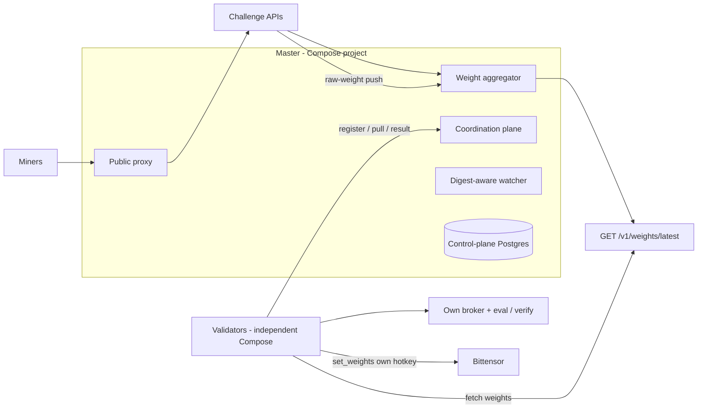

<div align="center">

# BASE

**Multi-challenge Bittensor subnet platform with master/validator orchestration.**

<a href="docs/miner/README.md">Miners</a> ·
<a href="docs/validator/README.md">Validators</a> ·
<a href="docs/master/README.md">Master</a> ·
<a href="docs/architecture.md">Architecture</a> ·
<a href="docs/challenges.md">Challenges</a> ·
<a href="docs/security.md">Security</a> ·
<a href="https://joinbase.ai">Website</a>

[](https://github.com/BaseIntelligence/base/actions/workflows/ci.yml)
[](https://github.com/BaseIntelligence/base/blob/main/LICENSE)
[](https://bittensor.com/)
[](https://github.com/BaseIntelligence/base/releases/tag/v3.1.2)


</div>

---

## Overview

BASE is a **multi-challenge Bittensor subnet platform**: independent challenge subnets run under one
validator network. BASE routes miner traffic to the right challenge, collects each challenge's raw
weights, normalizes emissions, maps hotkeys to Bittensor UIDs, and publishes the final vector for
validators to submit on-chain. Each challenge lives in its own repository and owns its submissions,
scoring, state, and public miner experience; BASE is the orchestration layer that runs them as one
subnet.

It runs as a single-host **Docker Compose** topology (Compose is the only supported operator path).
A **master** application hosts the public proxy, validator coordination plane, aggregation, and
digest-aware challenge watcher, with PostgreSQL as the durable control plane and one long-lived
combined service per active challenge. The master coordinates and aggregates but **never submits**
on-chain weights and **never launches** evaluator containers. Online **validators** use independent
Compose projects, register with the master, pull assignments, report results, and submit the master's
final vector with their own wallets.

### Public SDK release

Immutable Base Python package pin for consumers (including Prism):

| Field | Value |
|-------|--------|
| Version | **v3.1.2** |
| Wheel | `https://github.com/BaseIntelligence/base/releases/download/v3.1.2/base-3.1.2-py3-none-any.whl` |
| SHA-256 | `3a61c2d3a343ed6de55e80215486e3de0c9639276443d08f2ed316bc807f2ff0` |

There is no LLM gateway in this release. Challenge admission and scoring are owned by each challenge
service (Prism is deterministic). Agent-challenge remains diagnostic/incompatible relative to the
Compose target path.

## Architecture



## How It Works

1. The master tracks active challenges and their emission shares, and **auto-deploys** their long-lived Compose services from the registry (a newly-registered ACTIVE challenge propagates with no manual step).
2. Challenge services run isolated from the control plane and each other, each on its own `/data` volume.
3. Miners reach a challenge through BASE's public proxy.
4. Validators register, pull assignments from the coordination plane, execute or verify evaluation on their own side, and post results.
5. Each challenge computes raw hotkey weights and **pushes** them to the master for aggregation.
6. BASE normalizes challenge outputs, applies emission shares, and maps hotkeys to UIDs.
7. Each validator fetches the final vector from the weights API and calls **`set_weights`** on-chain under its own hotkey (tests may use a fake chain). The master aggregates but **never submits on-chain**.

If a challenge fails, BASE isolates that challenge's contribution without taking down the subnet.

## Roles

| Role | Responsibility |
|------|----------------|
| **Master** | Coordinates + aggregates; runs the proxy, coordination plane, broker, digest-aware watcher, and challenge services. Never executes evals or submits on-chain. |
| **Validators** | Decentralized executors: register + heartbeat, pull assignments, run/verify on their own side, and submit on-chain weights under their own hotkey. |
| **Challenge owners** | Own an independent repo, image, scoring logic, and state; push raw weights; expose the standard internal weight contract. |
| **Workers** | Optional miner-funded GPU executors for Prism (Lium/Targon or local), carrying an `ExecutionProof`. |

## Miner-Funded GPU Worker Plane

Optional, gated behind `compute.worker_plane_enabled` (env `BASE_COMPUTE__WORKER_PLANE_ENABLED`,
default **off** ⇒ byte-for-byte legacy behavior). It moves Prism heavy GPU evaluation onto
**worker agents in GPU instances the miners fund** (rented on **Lium** or **Targon**, or local),
deployed with the `base worker` CLI. Validators keep only light plausibility checks, probabilistic
replay audits, and weight submission.

- **Signed enrollment** — the miner signs a hotkey↔worker binding; provider keys (`LIUM_API_KEY` / `TARGON_API_KEY`) stay in the miner's environment and never reach the master.
- **Anti-collusion** — a worker never evaluates its owner's submission; each unit replicates across **R=2 distinct-owner** workers and is reconciled by `ExecutionProof.manifest_sha256`.
- **Proof tiers** — tier 0 (manifest hash + sr25519 signature), tier 1 (pinned image digest), tier 2 (in-guest attestation, gated off on Targon). Audit sampling is tier-modulated.
- **Agent Challenge Phala Intel TDX path (separate from the PRISM worker plane):** BASE carries
  the Phala-tier `ExecutionProof` / `EvalExecutionProof` schema (including `vm_config` ≤ 256 KiB),
  quote verification helpers, R=1 assignment for attested units, and public-proxy deny rules so
  agent-challenge capability, internal, and direct result-ingestion routes stay challenge-direct
  (default off). Flag-off: legacy byte-identical signed submission/env/launch proxy path and R=1
  own_runner behavior. Full attested mode uses **one miner-funded external eval (R=1)** with
  **zero** BASE validator re-exec multi-replica assignment; score acceptance remains challenge-
  owned. Details: [Architecture](docs/architecture.md#agent-challenge-phala-intel-tdx-path).
- **Admission rule** — when enforced, a miner needs ≥1 active bound worker to submit to Prism, else `403 NO_ACTIVE_WORKER`.

See the <a href="docs/miner/worker-plane.md">miner worker deployment guide</a>.

## Documentation

| Audience | Guide | Contents |
|----------|-------|----------|
| Miners | <a href="docs/miner/README.md">Miner guide</a> | Choose a challenge, submit through the proxy, track leaderboards |
| Miners | <a href="docs/miner/worker-plane.md">Worker deployment</a> | Deploy a miner-funded GPU worker on Lium/Targon |
| Validators | <a href="docs/validator/README.md">Validator guide</a> | Run an independent validator and submit on-chain weights |
| Operators | <a href="docs/compose.md">Compose deployment</a> | Supported single-host master and validator install |
| Operators | <a href="docs/deploy.md">Deploy from scratch</a> | Operator navigation for Compose-only bring-up |
| Operators | <a href="docs/master/README.md">Foundation master guide</a> | Master reference notes |
| Developers | <a href="docs/architecture.md">Architecture</a> | Control-plane vs challenge vs validator topology |
| Developers | <a href="docs/challenges.md">Challenges</a> | The challenge model |
| Developers | <a href="docs/challenge-integration.md">Challenge integration</a> | The API contract a challenge must expose |
| Developers | <a href="docs/security.md">Security model</a> | Trust boundaries and secret handling |
| Developers | <a href="docs/versioning.md">Versioning</a> | SemVer, Git tag, and GHCR tag policy |
| Developers | <a href="docs/reward-semantics.md">Reward semantics</a> | Terminal-Bench scorer reward mapping |

## Deploy

**Docker Compose is the only supported shipping operator path.** Scripts live under
`deploy/compose/` (`install-master.sh`, `install-validator.sh`, `docker-compose.yml`,
`docker-compose.validator.yml`).

Install the master control plane (PostgreSQL + master application + one long-lived container per
active challenge) with:

```bash
./deploy/compose/install-master.sh --project-name base-mission-master --port 3180
```

Install each **agent-only** independent validator with an explicit Base master URL (validators never
run master, PostgreSQL, challenges, or Docker socket):

```bash
# Local disposable master
./deploy/compose/install-validator.sh \
  --project-name base-mission-validator-a \
  --master-url http://127.0.0.1:3180

# Public network Base master API (authoritative)
./deploy/compose/install-validator.sh \
  --project-name base-validator-live \
  --master-url https://chain.joinbase.ai
```

The public Base master / coordination / weights API for this network is
`https://chain.joinbase.ai` (verify `GET /health` → `role=master`). Local disposable
masters remain valid for smoke only via an explicit loopback `--master-url`.

Typical master services: `base-master-validator`, `master-postgres`, and one `challenge-<slug>` per
active challenge (for example `challenge-prism`). Validators are separate Compose projects with their
own identity and wallet. The digest-aware watcher keeps challenge containers aligned with pinned
image digests.

```bash
curl -fsS http://127.0.0.1:3180/health
curl -fsS http://127.0.0.1:3180/version
curl -fsS http://127.0.0.1:3180/v1/registry
```

Full walkthrough: <a href="docs/compose.md">Compose deployment</a> and
<a href="docs/deploy.md">Deploy from scratch</a>.

Historical `deploy/swarm/` material is **unsupported** for new installs and is retained only as
frozen reference. LLM gateway services, tokens, and provider clients are **removed** from the target
path. Base and Prism never launch evaluator containers from this Compose project.

## Validation Quick Reference

Run from the repository root with Docker Compose available.

```bash
uv sync --extra dev --extra master
uv run ruff check .
uv run ruff format --check .
uv run mypy src tests
uv run pytest -m "not postgres" --cov=base --cov-report=term-missing --cov-fail-under=80
```

Evidence for local validation should live in a local, gitignored directory and must never contain
tokens, credentialed database URLs, registry credentials, or private keys.

## Repository Layout

```text
platform/
  src/base/         # CLI, APIs, orchestration, Bittensor wrappers
  alembic/          # PostgreSQL migrations
  config/           # YAML example configs
  docker/           # Dockerfiles and OCI image assets
  deploy/compose/   # Supported Compose installers and manifests
  deploy/swarm/     # Historical Swarm installers (unsupported)
  docs/             # Project, miner, validator, and challenge docs
  tests/            # Unit / runtime validation tests
```

## License

Apache-2.0
