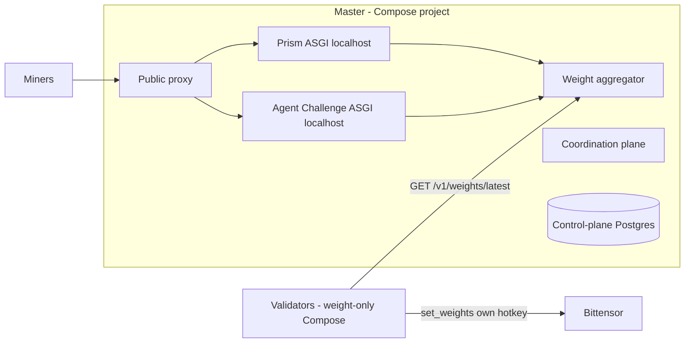

<div align="center">

# BASE

**Multi-challenge Bittensor subnet platform with master/validator orchestration.**

<a href="docs/miner/README.md">Miners</a> ·
<a href="docs/miner/getting-started.md">Miner getting started</a> ·
<a href="docs/validator/README.md">Validators</a> ·
<a href="docs/master/README.md">Master</a> ·
<a href="docs/architecture.md">Architecture</a> ·
<a href="docs/challenges.md">Challenges</a> ·
<a href="docs/security.md">Security</a> ·
<a href="https://joinbase.ai">Website</a> ·
<a href="https://chain.joinbase.ai/health">chain.joinbase.ai</a>

[](https://github.com/BaseIntelligence/base/actions/workflows/ci.yml)
[](https://github.com/BaseIntelligence/base/blob/main/LICENSE)
[](https://bittensor.com/)
[](https://github.com/BaseIntelligence/base/releases/tag/v3.1.2)


</div>

---

## Overview

BASE is a **multi-challenge Bittensor subnet platform**. Independent challenges (today **Prism** and
**Agent Challenge**) run under one validator network. BASE routes miner traffic to the right
challenge, collects each challenge's raw hotkey weights, normalizes emissions, maps hotkeys to
Bittensor UIDs, and publishes the final vector for validators to submit on-chain.

**Source layout (monorepo):** first-party challenge product sources live in this repository under
`packages/challenges/{prism,agent-challenge}`. Public GHCR image **names** and public path prefixes
(`/challenges/prism`, `/challenges/agent-challenge`) are unchanged. Standalone challenge remotes are
historical / transition only, not the required shipping layout. See
[docs/monorepo.md](docs/monorepo.md) and [docs/SOURCE_OF_TRUTH.md](docs/SOURCE_OF_TRUTH.md).

**Runtime (master-embed):** supported install is single-host **Docker Compose** with
**master + PostgreSQL only**. Prism and Agent Challenge run as **localhost ASGI processes inside the
master container** (supervisor + httpx reverse proxy). There are **no** separate required
`challenge-*` Compose app containers. The master coordinates and aggregates but **never submits**
on-chain weights and **never launches** evaluator containers.

**Validators (weight-only):** independent Compose projects point at
`https://chain.joinbase.ai`, fetch `GET /v1/weights/latest`, and submit that vector with their own
wallets. They do not host master, control-plane Postgres, or challenge writers.

Miner day-1 docs: [docs/miner/](docs/miner/README.md) (including
[prism](docs/miner/prism/README.md) and [agent-challenge](docs/miner/agent-challenge/README.md)).
Challenge / ops entry: [docs/challenges.md](docs/challenges.md).

### Public SDK release

Immutable Base Python package pin for consumers (including Prism):

| Field | Value |
|-------|--------|
| Version | **v3.1.2** |
| Wheel | `https://github.com/BaseIntelligence/base/releases/download/v3.1.2/base-3.1.2-py3-none-any.whl` |
| SHA-256 | `3a61c2d3a343ed6de55e80215486e3de0c9639276443d08f2ed316bc807f2ff0` |

There is no LLM gateway in this release. Challenge admission and scoring are owned by each embedded
challenge package (Prism is deterministic; NO-TEE provider-trust path). Agent Challenge is
gateway-free and mineable on the Compose master when attested flags and pins are healthy. Default
emission shares are **50% Prism + 50% Agent Challenge** (absolute). Day-1 miner path:
[docs/miner/getting-started.md](docs/miner/getting-started.md).

## Architecture



## How It Works

1. Master Compose runs **one** application container (proxy + embedded Prism + embedded Agent Challenge) and **one** PostgreSQL container.
2. Registry marks challenges ACTIVE with loopback `internal_base_url` (`127.0.0.1:18080` / `:18081`) and absolute emission shares (default **50% Prism + 50% Agent Challenge**).
3. Miners reach challenges through BASE's public proxy on unchanged prefixes
   `/challenges/prism` and `/challenges/agent-challenge` (and `/v1/challenges/...` bridges).
4. Each challenge owns submissions/scoring/state, then **pushes** authenticated raw hotkey weights to the master.
5. BASE normalizes challenge outputs, applies emission shares, maps hotkeys to UIDs, and seals a final vector.
6. Each **weight-only** validator fetches `GET /v1/weights/latest` and calls **`set_weights`** under its own hotkey. The master aggregates but **never submits on-chain**.

If a challenge fails scoring for an epoch, BASE isolates that share (burn/uid0 policy) without taking down the subnet.

## Roles

| Role | Responsibility |
|------|----------------|
| **Master** | Coordinates + aggregates; public proxy; embeds challenge ASGI; seals weight vectors. Never executes miner evals as --rm jobs or submits on-chain. |
| **Validators** | Weight-only by default: fetch master's vector and submit on-chain under their own hotkey. Do not host challenge writers. |
| **Challenge packages** | Live in `packages/challenges/*` (monorepo); own scoring + state; push raw hotkey weights. |
| **Workers** | Optional miner-funded GPU executors for Prism (Lium/Targon or local), carrying an `ExecutionProof`. |

## Miner-Funded GPU Worker Plane

Optional, gated behind `compute.worker_plane_enabled` (env `BASE_COMPUTE__WORKER_PLANE_ENABLED`,
default **off** ⇒ byte-for-byte legacy behavior). It moves Prism heavy GPU evaluation onto
**worker agents in GPU instances the miners fund** (rented on **Lium** or **Targon**, or local),
deployed with the `base worker` CLI. Validators keep only light plausibility checks, probabilistic
replay audits, and weight submission.

- **Signed enrollment** — the miner signs a hotkey↔worker binding; provider keys (`LIUM_API_KEY` / `TARGON_API_KEY`) stay in the miner's environment and never reach the master.
- **Anti-collusion** — a worker never evaluates its owner's submission; each unit replicates across **R=2 distinct-owner** workers and is reconciled by `ExecutionProof.manifest_sha256`.
- **Proof tiers** — tier 0 (manifest hash + sr25519 signature), tier 1 (pinned image digest), tier 2 (in-guest attestation, gated off on Targon). Audit sampling is tier-modulated.
- **Agent Challenge Phala Intel TDX path (separate from the PRISM worker plane):** BASE carries
  the Phala-tier `ExecutionProof` / `EvalExecutionProof` schema (including `vm_config` ≤ 256 KiB),
  quote verification helpers, R=1 assignment for attested units, and public-proxy deny rules so
  agent-challenge capability, internal, and direct result-ingestion routes stay challenge-direct
  (default off). Flag-off: legacy byte-identical signed submission/env/launch proxy path and R=1
  own_runner behavior. Full attested mode uses **one miner-funded external eval (R=1)** with
  **zero** BASE validator re-exec multi-replica assignment; score acceptance remains challenge-
  owned. Details: [Architecture](docs/architecture.md#agent-challenge-phala-intel-tdx-path).
- **Admission rule** — when enforced, a miner needs ≥1 active bound worker to submit to Prism, else `403 NO_ACTIVE_WORKER`.

See the <a href="docs/miner/worker-plane.md">miner worker deployment guide</a>.

## Documentation

| Audience | Guide | Contents |
|----------|-------|----------|
| Miners | <a href="docs/miner/README.md">Miner hub</a> | Phala-style IA: start here for joinbase mining |
| Miners | <a href="docs/miner/getting-started.md">Miner getting started</a> | Wallet, chain.joinbase.ai, pick Prism or Agent Challenge (&lt;15 min) |
| Miners | <a href="docs/miner/concepts.md">Miner concepts</a> | Absolute **50/50** emission (Prism + Agent Challenge), roles |
| Miners | <a href="docs/miner/how-to.md">Miner how-to</a> | Day-1 tasks + monorepo challenge hubs |
| Miners | <a href="docs/miner/prism/README.md">Prism miner hub</a> | Pack / sign / submit Prism seeds |
| Miners | <a href="docs/miner/agent-challenge/README.md">Agent Challenge miner hub</a> | Submit agent + advanced self-deploy |
| Miners | <a href="docs/miner/reference.md">Miner reference</a> | Public routes and signature headers |
| Miners | <a href="docs/miner/troubleshooting.md">Miner troubleshooting</a> | 401 / 429 / 502 checklist |
| Miners | <a href="docs/miner/worker-plane.md">Worker deployment</a> | Deploy a miner-funded GPU worker on Lium/Targon |
| Validators | <a href="docs/validator/README.md">Validator guide</a> | Run an independent validator and submit on-chain weights |
| Operators | <a href="docs/compose.md">Compose deployment</a> | Supported single-host master and validator install |
| Operators | <a href="docs/deploy.md">Deploy from scratch</a> | Operator navigation for Compose-only bring-up |
| Operators | <a href="docs/monorepo.md">Monorepo layout</a> | Workspace members, local image builds, GHCR names |
| Operators | <a href="docs/SOURCE_OF_TRUTH.md">Source of truth</a> | Standalone remote transition note |
| Operators | <a href="docs/master/README.md">Foundation master guide</a> | Master reference notes |
| Developers | <a href="docs/architecture.md">Architecture</a> | Control-plane vs challenge vs validator topology |
| Miners + ops | <a href="docs/challenges.md">Challenges</a> | Miner+ops entry: monorepo packages, master-embed, joinbase, weight-only validators |
| Developers | <a href="docs/challenge-integration.md">Challenge integration</a> | The API contract a challenge must expose |
| Developers | <a href="docs/security.md">Security model</a> | Trust boundaries and secret handling |
| Developers | <a href="docs/versioning.md">Versioning</a> | SemVer, Git tag, and GHCR tag policy |
| Developers | <a href="docs/reward-semantics.md">Reward semantics</a> | Terminal-Bench scorer reward mapping |

## Deploy

**Docker Compose is the only supported shipping operator path.** Scripts live under
`deploy/compose/` (`install-master.sh`, `install-validator.sh`, `docker-compose.yml`,
`docker-compose.validator.yml`).

Install the master control plane (PostgreSQL + master application with **embedded** Prism and Agent
Challenge ASGI) with:

```bash
./deploy/compose/install-master.sh --project-name base-mission-master --port 3180
```

Install each **weight-only** independent validator with an explicit Base master URL (validators never
run master, PostgreSQL, or challenge control-plane services):

```bash
# Public network Base master API (authoritative shipping example)
./deploy/compose/install-validator.sh \
  --project-name base-validator-live \
  --master-url https://chain.joinbase.ai

# Local disposable master (secondary; smoke/dev only)
./deploy/compose/install-validator.sh \
  --project-name base-mission-validator-a \
  --master-url http://127.0.0.1:3180
```

The public Base master / coordination / weights API for this network is
`https://chain.joinbase.ai` (verify `GET /health` → `role=master`). Local disposable
masters remain valid for smoke only via an explicit loopback `--master-url`.
Any other historical public hostname is non-authoritative only (may return 502);
do not document it as the shipping master URL.

### Production topology

| Piece | Live production |
|-------|-----------------|
| Master runtime | Compose project **`base-master-prod`**: **master + postgres only** (Swarm inactive) |
| Public master API | **`https://chain.joinbase.ai` only** (`role=master`). Other historical hostnames are non-authoritative secondary. |
| Example validator | Agent-only **weight-only** Compose, `master_url=https://chain.joinbase.ai` |
| Challenges | **Prism + Agent Challenge** embedded in master (loopback ASGI). No separate `challenge-*` app containers required. |
| On-chain weights | Validators call `set_weights` with their own wallets. Master never does. |
| Public website | **https://joinbase.ai** → API `https://chain.joinbase.ai` |

Typical master services: `base-master-validator` and `master-postgres` only. Challenge packages are
installed into the master image; public paths stay `/challenges/prism` and
`/challenges/agent-challenge`. Validators are separate Compose projects with their own identity and
wallet.

```bash
curl -fsS http://127.0.0.1:3180/health
curl -fsS http://127.0.0.1:3180/version
curl -fsS http://127.0.0.1:3180/v1/registry
```

Full walkthrough: <a href="docs/compose.md">Compose deployment</a> and
<a href="docs/deploy.md">Deploy from scratch</a>.

Historical `deploy/swarm/` material is **unsupported** for new installs and is retained only as
frozen reference. LLM gateway services, tokens, and provider clients are **removed** from the target
path. Base and Prism never launch evaluator containers from this Compose project.

## Validation Quick Reference

Run from the repository root with Docker Compose available.

```bash
uv sync --extra dev --extra master
uv run ruff check .
uv run ruff format --check .
uv run mypy src tests
uv run pytest -m "not postgres" --cov=base --cov-report=term-missing --cov-fail-under=80
```

Evidence for local validation should live in a local, gitignored directory and must never contain
tokens, credentialed database URLs, registry credentials, or private keys.

## Repository Layout

```text
platform/
  src/base/                              # CLI, APIs, orchestration, Bittensor wrappers
  packages/challenges/prism/             # Prism challenge package (monorepo)
  packages/challenges/agent-challenge/   # Agent Challenge package (monorepo)
  alembic/                               # PostgreSQL migrations
  config/                                # YAML example configs
  docker/                                # Master / validator-runtime Dockerfiles + embed entrypoint
  deploy/compose/                        # Supported Compose installers and manifests
  deploy/swarm/                          # Historical Swarm installers (unsupported)
  docs/                                  # Project, miner, validator, and challenge docs
  tests/                                 # Unit / runtime validation tests
```

## License

Apache-2.0
