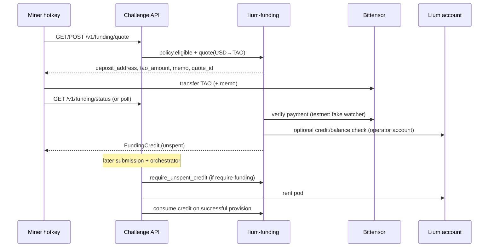

# Lium funding — shared challenge GPU prepay

**Status:** scaffolding on branch `lium-funding` (not enabled in prod).  
**challenge-agnostic crate:** `lium-funding`  
**First consumer:** Prism (`challenge_id = prism`)

Miners prepay **TAO** covering the operator’s Lium GPU rental cost (USD market
price converted to TAO, plus a buffer). Funds land in an **operator-controlled
Lium wallet / deposit address**; the challenge grants a one-shot
`FundingCredit` before any pod rent.

This is **not** miner-side Lium accounts. The BASE master still rents pods with
`LIUM_API_KEY` as today; funding is a **reimbursement + eligibility ledger**
shared by challenges that opt in.

## Flow



1. **Quote** — miner supplies `challenge_id` + hotkey. Policy checks eligibility.
2. **Pay** — miner sends the quoted TAO to the operator deposit address, with a
   memo keyed by `(challenge_id, hotkey, quote_id)`.
3. **Confirm** — payment verifier watches the deposit address (or accepts a
   testnet fake). Optionally reconcile operator Lium USD balance via
   `GET /users/me` (`X-API-Key`).
4. **Credit** — grant `FundingCredit` (one unspent credit per hotkey when the
   policy sets `one_funding_per_hotkey`).
5. **Rent gate** — before Lium `provision`, challenge calls
   `require_unspent_credit`. On successful provision, **consume** the credit
   (consume-once).

## Pricing

```text
usd_cost = rate_usd_per_hour * hours * (1 + buffer)
tao_amount = usd_cost / tao_usd_price
```

| Knob | Env (shared / Prism) | Default |
|------|----------------------|---------|
| `rate_usd_per_hour` | `LIUM_FUNDING_RATE_USD_PER_HOUR` / `PRISM_FUNDING_RATE_USD_PER_HOUR` | `0.67` (Prism) |
| `hours` | `LIUM_FUNDING_HOURS` / `PRISM_FUNDING_HOURS` | `6` (Prism train cap) |
| `buffer` | `LIUM_FUNDING_BUFFER` | `0.10` (+10%) |
| Require gate | `PRISM_REQUIRE_LIUM_FUNDING` | `0` (off) |

**Prism example:** \(0.67 \times 6 \times 1.10 = 4.422\) USD → convert at live TAO/USD.

### Price oracle (assumptions)

Scaffolding uses a pluggable `TaoPriceOracle`:

| Backend | When | Notes |
|---------|------|--------|
| `FixedTaoOracle` | tests / local | Constant USD per TAO |
| `EnvTaoOracle` | staging | `LIUM_FUNDING_TAO_USD` |
| Live (TODO) | prod | Prefer a Bittensor-friendly source (e.g. subnet/TAO spot from a documented
  public API or on-chain derived price). **Do not** silently fall back to stale
  cache without an explicit max-age; fail closed on quote if oracle is stale.

Assumptions for go-live (document when wiring the live oracle):

- Quote currency is **TAO** on the Finney/testnet the deposit wallet uses.
- Oracle returns **USD per 1 TAO**; division yields TAO to send.
- Quotes have a short TTL (`LIUM_FUNDING_QUOTE_TTL_SECS`, default 900).

## Per-challenge policy

```rust
trait ChallengeFundingPolicy {
    fn challenge_id(&self) -> &str;
    fn economics(&self) -> FundingEconomics; // rate, hours, buffer
    async fn ensure_eligible(&self, hotkey: &str) -> Result<(), FundingError>;
    fn one_funding_per_hotkey(&self) -> bool;
}
```

| Challenge | Eligibility (pluggable) | Economics |
|-----------|-------------------------|-----------|
| **Prism** | Hotkey **in metagraph** AND **zero prior Prism submissions** (store count / gating `open` never registered) | `$0.67/h × 6h × 1.10` |
| Design / others | Opt-in later with their own checker | Challenge-specific |

## Lium integration

Operator account uses the same REST surface as `prism-lium`
(`https://lium.io/api`, `X-API-Key`):

| Concern | Lium surface | Our wrapper |
|---------|--------------|-------------|
| Account balance (USD) | `GET /users/me` → `balance` | `LiumAccountClient::balance_usd` |
| Stablecoin top-up (agents) | CLI `lium topup` / `POST /nowpayments/create-invoice` | Optional; **miner path is TAO→deposit**, not USDT |
| TAO fund from btcli wallet | CLI `lium fund -w … -a …` | Operator runbook (not miner-facing) |
| Pod rent | existing `prism-lium` | Unchanged; gated by credit |

Docs: [CLI quickstart](https://docs.lium.io/developers/cli/quickstart),
[`lium fund`](https://docs.lium.io/developers/cli/reference/fund.md),
[`lium topup`](https://docs.lium.io/developers/cli/reference/topup.md),
[AI agents](https://docs.lium.io/developers/agents.md),
OpenAPI `https://lium.io/api/openapi.json`.

## HTTP surface (Prism hosts for now)

| Route | Who | Purpose |
|-------|-----|---------|
| `POST /v1/funding/quote` | miner | Body `{challenge_id, hotkey}` → quote + deposit |
| `GET /v1/funding/quote` | miner | Query `challenge_id` + `hotkey` (same) |
| `GET /v1/funding/status` | miner | Query `challenge_id` + `hotkey` → credit/deposit state |
| `GET /v1/funding/admin/credits` | admin bearer | List credits (scaffold) |

Admin bearer: file/env `LIUM_FUNDING_ADMIN_TOKEN` (never bake into images).

## Security

- **Never** bake Lium API keys, deposit coldkeys, or hotkeys into images or
  compose. Use age + files under `deploy/secrets/lium/` (see README there).
- Digest-only deploy pins when this ships to staging/prod (same as rest of BASE).
- Deposit watching and oracle calls are master-only (same host as challenges).
- Redact API keys in logs/`Debug` (mirror `prism-lium`).
- **Do not** set `PRISM_REQUIRE_LIUM_FUNDING=1` until the deposit wallet, oracle,
  and watcher are live — default **off** so prod is not bricked.

## Prism wiring

- Policy defaults: registered metagraph member + no prior Prism submission;
  economics `0.67 × 6 × 1.10`.
- Orchestrator: after pre-pod screens, **before** `EvalJobBackend::provision`,
  call `FundingGate::before_rent`. On success, `consume` after provision Ok.
- Feature flag: `PRISM_REQUIRE_LIUM_FUNDING=0` (default). When off, gate is a
  no-op (existing tests / prod unchanged).

## Enable later (go-live checklist)

1. Create operator Lium account + API key; store under `deploy/secrets/lium/`.
2. Create Bittensor deposit coldkey/hotkey; document SS58; age-encrypt.
3. Wire live `TaoPriceOracle` + on-chain deposit watcher (memo parse).
4. Operator funds Lium (`lium fund` / topup) so rents do not fail on balance.
5. Staging: flag on, quote→pay(fake/testnet)→credit→submit→rent→consume.
6. Only then set `PRISM_REQUIRE_LIUM_FUNDING=1` in prod compose env.

## Related

- [`PRISM.md`](PRISM.md) — Prism challenge
- [`runbooks/prism-enable-lium-and-emission.md`](runbooks/prism-enable-lium-and-emission.md)
- Crate: `crates/lium-funding/`
