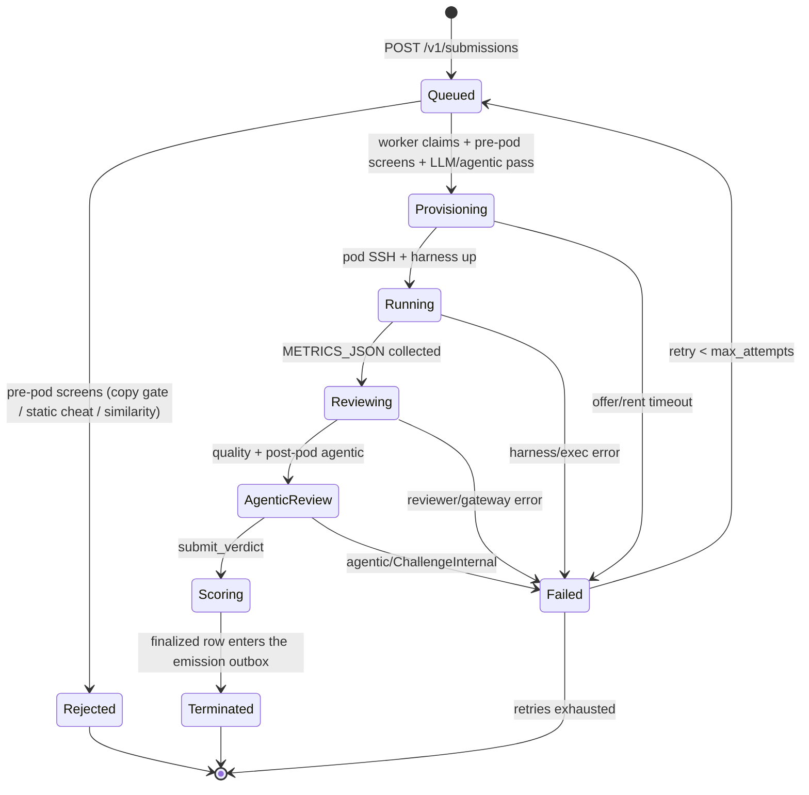

# PRISM challenge (Base)

**challenge_id:** `prism`  
**scoring_version:** `2` live (bpb-only; v1 blended a 0.3 LLM quality vote; the architecture competition below reallocates credits *inside* this same lattice — no chain-facing version change). **v3 addition (opt-in):** composite scoring ships behind `PRISM_SCORING_MODE` (`shadow` default — v2 score bit-identical, composite observed; `composite` — v3 lattice becomes the score, rows carry `scoring_version 3`). See **v3 composite scoring** below.  
**recipe_version:** `2.0.0` (pinned NeMo AutoModel base + miner unified diff; legacy **1.x** two-script / source-tree layouts rejected on live — see [`PRISM_RECIPE.md`](PRISM_RECIPE.md))  
**port:** `8092`  
**emission_share_bps:** `5000` (equal split with `design`; sum `10000`)  
**GPU path:** master-centralized **Lium** (no Phala CVM)

## What it is

PRISM on Base (recipe **2.0.0**) accepts miner submissions as a **unified
diff against a pinned [NeMo AutoModel](https://github.com/NVIDIA-NeMo/Automodel)
checkout** — ZIP members `automodel.base` (pin id) + `automodel.patch` (+
optional `prism.toml`). Megatron-Bridge and free-form
`architecture.py` / `training.py` (or 1.x source-tree) layouts are **not**
accepted on live. Novel architectures remain allowed when expressed as
AutoModel extensions in the patch. Full pin fields and ZIP layout:
[`PRISM_RECIPE.md`](PRISM_RECIPE.md).

Each evaluation runs on a Lium GPU pod **funded by the miner** via
`X-Lium-Api-Key` (Sim backend in CI only). Intake applies the patch
fail-closed onto the pin; the delta is persisted for
`GET /v1/submissions/{id}/diff`. Copy / similarity / agentic review focus on
the **miner delta** (touched files / hunks), then the shared **agentic**
anti-cheat verifier (`challenge-agentic`: tools + AST + metrics/receipt;
OpenRouter when keyed, `SimAgent` in CI). The harness wrap still enforces
the **telemetry contract** (`prism_telemetry.report` +
`finish_evaluation`); missing or stripped hooks are a hard contract
violation (`missing_telemetry_hooks` → `Score(0)`, terminal). Cheap
`Copied` is a hard first filter; cheap `Suspicious` hard-zeros only when
`score ≥ 0.9` (`SUSPICIOUS_HARD_ZERO_THRESHOLD`) and evidence is not
generic-trope-only. Agentic is the primary anti-cheat judge and must not
treat standard LM components as plagiarism. The LLM quality vote is a
**coherence gate, never a grader**: the final score is pure bpb, with
hard-zero on agentic `cheat`/`suspicious` and cheap `Copied` / high-confidence
`Suspicious`. Missing agentic verdict is fail-closed (`ChallengeInternal`).
Leaves are D24-complete per chain epoch, emitted at
epoch close from the finalized-since-last-epoch batch (see **Leaf emission**
below). Review findings are audit events, not points.

> **Historical 1.x path.** Recipe ≤ 1.4.0 accepted two-script
> (`architecture.py` + `training.py`), training-only + `arch_id`, and
> source-tree ZIPs. That contract text remains in
> [`PRISM_RECIPE.md`](PRISM_RECIPE.md) (legacy section) and in the
> architecture-registry sections below for leaf/audit continuity; live
> intake under 2.0 rejects those layouts (`unsupported_layout` /
> `recipe_version`).

This is **not** agent-challenge Phala/TDX attestation and **not**
hypertraining B300 tournament code.

## Orchestration state machine



All transitions are append-only events in `prism_stage_event`; the row state
lives in `prism_submission`. Live measure runs the harness **detached** on the
pod (`setsid` + `harness.log` / `harness.pid`) so a control-plane restart does
not SIGHUP GPU work. On boot (and every ~30s) orphan reconcile is
**resume-first**: mid-flight `provisioning`/`running` rows whose Lium pod is
still alive and whose BYOK key can be restored from the sealed vault
(`PRISM_PAYER_VAULT_DIR`, default TTL ≥**36h** / train+eval+skew; heartbeats
re-seal) are requeued with `pod_id` kept — the orchestrator reattaches
(log/event poll → wait terminal → harvest → score) without terminating the
pod. Only unreattachable rows fail-closed (`control_plane_restart` /
`harness_detached`) with best-effort terminate. Post-measure review stages
still requeue. Residual gap: expired seal + no operator fallback ⇒ cannot
call Lium API ⇒ fail-orphan (miner must stop the pod and resubmit). The stuck
sweeper remains a **10h** backstop and skips live workers.
`GET /v1/submissions/{id}/logs?since=` exposes harvested harness tails +
heartbeats while a pod is measuring.

**Metrics harvest (v3):** the harness writes `METRICS_JSON=` to stdout **and**
`/tmp/prism_eval/metrics.json`. Master harvest prefers that sidecar (else
`grep '^METRICS_JSON=' harness.log`) plus terminal markers — it must not rely
on a fixed-byte `tail` of `harness.log` alone. Battery blobs often exceed
32 KiB; a tail that keeps `EVAL_OK` but drops the `METRICS_JSON=` prefix
falsely fails the run after GPU work. Failed rows whose `error_detail` only
retains a truncated log (no recoverable `bpb` / `metrics_json`) **cannot** be
offline-recovered from the DB — after deploying this fix, operators
`POST /v1/submissions/{id}/retry` (admin Bearer) and
`POST /v1/admin/gating/{hotkey}/reset` so the miner can re-run measure.

Evaluation (Lium / Sim, review, agentic, leaf emit) is **master-only**.
Validators never run `prism-challenge` — they fetch sealed weights only.

## Submission gating (shared with design)

Intake requires the miner hotkey **in the metagraph** (cached snapshot) and
enforces **one accepted submission per `(prism, hotkey)`**
(`submission_gating` table): non-`open` rows → `409 submission_gated`;
unknown hotkey → `403 hotkey_not_in_metagraph`. Infra-class failures
(`install` = Lium/pod, `ast_infra` = similarity, `llm_infra` = review/agentic)
**auto-retry up to 3 times** before a terminal `blocked`; cheat / suspicious
verdicts are terminal `rejected` (no retry). Retries of a **post-run** failure
(`llm_infra` / `ast_infra` after the pod job completed) resume from the
persisted measurement — the train+eval job is never re-run for a master-side
review failure; only `install` retries re-provision. Lium **HTTP 429** on rent is
special: `lium-rent-pool` serializes rents (≤**3 / 5s**, ≤**60 / hour**),
waits on `Retry-After` / body hints, and the orchestrator **requeues without
burning** `retry_count` / gating attempts. A background tick re-queues
failed 429 rows from the last **6 hours**. After an infra `blocked`, the
miner may **resubmit for up to 30 minutes** (new `POST /v1/submissions` or
`POST /v1/submissions/{id}/retry` for `ChallengeInternal`); after the window
the slot stays blocked until the metagraph watcher reopens it (hotkey left /
replaced).

**Training-only entries** gate separately under the composite challenge key
`prism:train:<arch_id>`: one accepted entry per `(hotkey, arch_id)`, with
the same auto-retry classes, the same terminal `rejected`/`blocked` states,
and the same watcher resets (reconciliation is prefix-scoped, so `prism`
covers every `prism:train:*` row). Idempotency stays the contract-bytes
`submission_id`: resubmitting identical bytes is an `already-queued` no-op,
never a gate conflict.

## Architecture registry + competition

Since recipe **1.2.0**, PRISM is an **architecture competition**, not only a
training tournament.

**Registry (`prism_architecture`, migration 0010).** An architecture becomes
*published* — referenceable by other miners — only after its owning
submission survived every gate (copy gate, LLM review, agentic) and reached
`terminated` with a real measured score. Rejected/cheated architectures
never publish. `arch_id = arch_<first 16 hex of sha256(architecture_py)>`;
the full digest is unique (simultaneous identical architectures share the
first registration; the copy gate makes later copies terminal anyway).

**Training-only submissions.** Body: `training.py` + `arch_id`
(`architecture_py` empty — source is pulled from the registry at intake and
denormalized onto the row; ZIP path: `training.py`-only archive +
`X-Prism-Arch-Id` header). Unknown `arch_id` → `404 unknown_arch`; inline
source with `arch_id` → `400`. Training-only rows **skip** the copy gate and
the similarity judgment (their architecture is registry-identical by design)
and are exempt from the agentic corpus-copy check against their own arch;
the telemetry-hooks rule and metrics forge checks still apply. Gating:
`prism:train:<arch_id>` as above — one accepted entry per
`(hotkey, arch_id)`, retries same rules.

**Leaf emission (epoch-close, exactly-once outbox + score carry + tip refresh).** A
submission row's acceptance epoch (`prism_submission.epoch`) is intake
metadata only. A dedicated emitter loop (`prism-emit`) emits a
**D24-complete leaf set** for the live chain epoch: the first tick that
observes epoch `E` assigns every submission finalized since the previously
emitted epoch — the outbox batch,
`kind IS NOT NULL AND emitted_epoch IS NULL` — to `E`, competition-aggregates
that batch **unioned with every still-active positive lattice score**
(`kind = 'score' AND score > 0`), signs the full expected set
(`NoScore(NotAttempted)` for everyone else), submits it, and advances the
per-netuid emit cursor (`prism_emit_cursor`, migration 0012). Later ticks on
the same tip **re-submit** the current WTA projection so a mid-epoch champion
change tip-supersedes gateway leaves (`payload_digest` change → 202; identical
digest → 409-as-ok). Cursor does not advance again on tip refresh. This fixes
the acceptance-epoch bugs (a submission accepted in epoch `X` but finalized in
`X+k` never scored) while keeping `/v1/weights/latest` aligned with live WTA
after tip reseal. Architecture-owner credit stays off
(`OWNER_ARCH_CREDIT_ENABLED = false`).

Exactly-once **outbox assignment** per scoring run: batch assignment is sticky
before submit, the cursor advances only after the first full set for an epoch
landed, and a crash mid-submit replays the identical assigned set on the next
tick. After assignment, a positive `Score(v>0)` keeps participating in every
later epoch's competition set until a better/valid score supersedes it via
lattice `max` — so an empty or reject-only fresh batch does not burn the prism
share. Leaf emission then applies **winner-take-all**
(`prism_registry::apply_wta`): only the single highest positive credit
(lexicographically smallest hotkey on ties) receives a positive Score leaf;
every other positive credit is zeroed. `Score(0)` rejects and `NoScore`
absences do not carry. A manually retried + re-scored row re-enters the outbox
(`reset_for_retry` clears the watermark). Epochs during a master outage carry
no *new* outbox rows; the first epoch after recovery still includes active
positive scores plus any backlog (seals always pin fresh epochs — stale
bundles can never Match on-chain). Run **exactly one** prism-challenge emitter
instance per netuid (single master topology).

**Competition scoring (epoch-local, SCORE_MAX lattice preserved; prism
`SCORING_VERSION` stays 2 — the competition reallocates credits inside the
existing lattice, and epoch-close batching changes only *which* epoch a score
lands in, not the leaf format or the math).** Per emitted epoch set:

- *submitter credit* (normative): a hotkey's own best lattice score across its
  rows in the epoch's competition set (fresh outbox + active carry). Credit
  attaches to `miner_hotkey` on the scored submission — the UID that **posted**
  the run — never to the architecture registry owner.
- *architecture-owner credit*: **disabled for emission**
  (`OWNER_ARCH_CREDIT_ENABLED = false` in `prism-registry`). Arch ownership
  still exists for top-model / publish bookkeeping, but it must **not** divert
  Prism weight. Do not re-enable without an explicit product change.
- *per-hotkey credit*: **own score only** (best-BPB submitter). `Score(0)`
  rows (cheat/copy-gate) never win; hotkeys whose rows are all `NoScore` keep
  their absence.
- *WTA emission*: argmax over positive per-hotkey credits → one Score leaf;
  Prism's emission share (50% of the subnet) goes entirely to that **submitter**
  (best BPB → that submission's miner UID).
- *Recipe 2.0 / AutoModel weight eligibility* (fail-closed): only submissions
  with recipe major ≥ 2, an `automodel@…` pin signal, or a packed tree
  containing `.prism/automodel.patch` may carry into the competition set or
  win WTA. Legacy 1.x positives remain in Postgres / site FE history but are
  treated as `Score(0)` for emission; if every positive score is ineligible,
  the epoch projects all-zero (burn / hold) — never emit Prism share to 1.x.

**Top-model publish + secure receive.** The master tracks the global best
bpb across **weight-eligible** (recipe 2.0 / AutoModel) scored submissions.
After a successful Lium eval it
**pulls** `checkpoint.pt` from the pod over SSH (master-initiated; the pod
never pushes) and stages it through the secure receive hook into
`$PRISM_ARTIFACT_DIR/<submission_id>/` **before** terminate. Staging
fail-closes on oversized packs, unexpected tar members, path traversal /
symlinks, and writes `MANIFEST.json` + `RECEIPT.json` (sha256).
Default park root is `/var/lib/prism/artifacts` (compose volume
`prism-artifacts`); the image pre-creates it owned by uid **65532** (`base`).
Harvest calls `ensure_artifact_root` first — a missing/unwritable root
surfaces as `lium exec: mkdir <path>: Permission denied …` (not a silent
skip). Re-create or `chown 65532` the volume if an older empty root-owned
volume was already provisioned.

**Size budget (FP32 × 2 × 1.5).** Cap = `n_params × 4 × 2 × 1.5` bytes =
`n_params × 12` (exact integer; see `prism_artifacts::checkpoint_byte_budget`).
The v3 harness parks FP32 `torch.save` state_dicts; `n_params` dedupes tied
weights (embed ↔ lm_head) but the pickle can materialize each state_dict key,
so the budget includes a 2× tying factor on top of 1.5× pickle/tar overhead.
Harvest uses the harness-measured `n_params` from `METRICS_JSON`; when
missing (older harness), it falls back to `prism_recipe::max_params()`
(350M, or `PRISM_TEST_MAX_PARAMS` in staging). Admin
`POST /v1/admin/artifacts/{id}/receive` resolves `n_params` from the
submission store, else requires `X-Prism-N-Params` (fail-closed if
unknown). HTTP body ceiling is recipe-max × 12 (~3.91 GiB); the per-receive
check is tighter when measured params are known. Oversized payloads are
refused **before** writing.

Top-model publish calls `verify_parked` and refuses weights without a
valid receipt. On a new global best (≤ best ever and < last published), it
publishes `architecture.py` + `training.py` + `METRICS.json` +
`ARTIFACT.json` + a `README.md` block to the public
[`BaseIntelligence/prism`](https://github.com/BaseIntelligence/prism) repo
under `top-model/` via the GitHub contents API; large checkpoints upload as
a mutable Release tag `prism-top-model`. The same trigger also commits a
**reloadable custom-arch pack** to HuggingFace
(`PRISM_TOPMODEL_HF_TOKEN_FILE`, default repo
`BaseIntelligence/top-prism-architecture`): seam sources, AutoModel novelty
under `sources/`, `config.json` + `trust_remote_code` wrappers, and
`checkpoint.pt` (LFS when large). The publication is journaled
(`prism_topmodel_publication`). GitHub token:
`PRISM_TOPMODEL_GITHUB_TOKEN_FILE` (`deploy/secrets/github/token`);
absent/empty → publish no-op. With `PRISM_TOPMODEL_REQUIRE_WEIGHTS=1`
(default), a missing/invalid receipt fails the publish (no journal).
Operators may re-stage via `POST /v1/admin/artifacts/{id}/receive` (same
admin Bearer; requires `X-Prism-Sha256`; `n_params` from store or
`X-Prism-N-Params`) — never an open pod upload.

## v3 composite scoring (versioned addition — opt-in)

Everything in this section is a **versioned addition**: the live leaf score
stays v2 pure-bpb until governance flips `PRISM_SCORING_MODE=composite`
after the placeholder anchors are measured on the E6 baselines and
hash-committed. Modes (`prism-pipeline::ScoringMode`):

| Mode | Leaf score | `scoring_version` on rows |
|------|-----------|---------------------------|
| `shadow` (default; the v2/"legacy" behavior) | v2 `score_from_bpb` — **bit-identical** | `2` |
| `composite` | v3 lattice (fail-closed `0` without a scored composite) | `3` |

**Source-tree submissions (v3 / recipe 1.3–1.4 historical).** Under recipe
≤ 1.4.0, miners could submit a full source tree as a ZIP (`zip_base64` or
`application/zip` with `prism.toml`; `train.py` / `training.py` entry) with
optional `kernels/`. **Recipe 2.0.0 live intake rejects that layout** in
favor of `automodel.base` + `automodel.patch` (see
[`PRISM_RECIPE.md`](PRISM_RECIPE.md)).

**Two-phase pod flow (v3).** The multi-file harness (`main.py` +
`prismlib/`, miner code in an `unshare --net` subprocess) runs two fresh
subprocesses: `phase=train` trains and checkpoints, prints the
`PHASE_TRAIN_DONE` marker, and the parent then holds on
`$PRISM_EVAL_ASSETS_DIR/.ready` — the operator stages the **public HF
held-out pack** (or optional private contamination mirrors) plus a
generator seed **only after** the train phase completes (over SSH on real
Lium; a local dir on Sim). The eval phase starts as a fresh subprocess with
`PRISM_EVAL_SECRET_SEED` in env only (never on disk; unset immediately after
reading). No `.ready` within the wait budget → fail-closed error, **never**
a silent downgrade to embedded `public_dev` fixtures. Relevant env:
`PRISM_PHASE`, `PRISM_EVAL_ASSETS_DIR`, `PRISM_EVAL_SECRET_SEED`,
`PRISM_EVAL_TIER`.

**Eval tiers (fail-closed staging).** With staged assets the battery
defaults to `eval_tier=public` (full G1 domains + fresh FineWeb dump + G2/G5
from public HF — held-out, not secret; build via
`harness/eval/build_public_pack.py`). Optional `PRISM_EVAL_TIER=private`
keeps secret contamination mirrors. Without staged assets the run uses
`public_dev` (tiny embedded fixtures). The realized tier is recorded on the
run (`eval_tier`). Overnight operator recipe:
[`docs/runbooks/prism-overnight-battery.md`](runbooks/prism-overnight-battery.md).

**The G1–G8 battery** (harness `eval/` package, all organizer-measured —
Zone A `org.*` metrics):

| Group | Axis | Weight |
|-------|------|--------|
| G1 | intrinsic fit (tokenizer-neutral `org.g1.bits_per_byte_*` + debug per-token `g1.bpb.*`) | 0.25 |
| G2 | commonsense/reading 0-shot core (LAMBADA, HellaSwag, PIQA, ARC, Winogrande, BoolQ, OBQA) | 0.15 |
| G3 | retrieval/associative recall (MQAR, copying, induction, passkey — procedural, memorization-proof) | 0.10 |
| G4 | reasoning at small scale (S5 permutations, arithmetic, ProofWriter, Dyck-k, modular, K&K) | 0.15 |
| G5 | long-context **pretrain-only** (RULER + BABILong + LongBench-v2 MCQ + HELMET RAG few-shot base; lengths in miner-tokenizer tokens; `org.g5.lstar`) — no IFT/chat/judge | 0.15 |
| G6 | sample efficiency from the train-phase probe curve (AUC over log-tokens, tokens-to-threshold) | 0.075 |
| G7 | inference efficiency (TTFT/TPOT/throughput, state card, joules/token) | 0.075 |
| G8 | training stability + µP LR-transfer | 0.05 |

**G8 `org.g8.mup_lr_stability`.** Rollup of the µP width×LR micro-sweep:
`1/(1+|log2(best_lr_wide/best_lr_base)|)` when the sweep converges; **0.0
fail-closed** when the sweep path runs but diverges / build fails / width
knob unsupported / budget cuts it short (so the G8 composite always sees
the key after a real sweep). Tiny-caps test skips omit the key.

**G5 scored keys (recipe ≥ 1.4.0).** The battery is an evaluation of
**pretrained base LMs** — completion / few-shot base prompts, short EM or
choice logprob only. No instruction-tuning, chat templates, free-form
summarization, or LLM-as-judge on the ranked path. Length targets are
tokens of the **miner-submitted** tokenizer (`ctx["tokenizer"]`; GPT-2 is
a baseline/fallback default, not a rule). Canonical Zone A keys and
internal G5 weights (group weight stays 0.15):

| Key | Role | Internal weight |
|-----|------|-----------------|
| `org.g5.ruler_acc` | RULER `niah_mk/mq/mv` + `vt` + `qa` (4k–32k; **64k** on `niah_mk`+`vt`) | 0.35 |
| `org.g5.babilong_acc` | BABILong QA1–QA5 (4k/8k/16k; short-answer EM) | 0.25 |
| `org.g5.natural_mcq_acc` | LongBench-v2 MCQ ≤16k (4-way logprob; mirrored) | 0.15 |
| `org.g5.helmet_rag_acc` | HELMET RAG few-shot base (substring EM; mirrored) | 0.15 |
| `org.g5.lstar` | Length capability L*: highest L on pooled RULER+BABILong per-length means with `acc(L) ≥ 0.9×acc(L_min)` and `acc(L) ≥ 0.25` (else `0`); normalized as `efficiency_log_ratio` over `[4096, 65536]` | 0.10 |

**Composite math** (`prism-pipeline::composite`, research/12 §7 steps 0–6):
per-metric fixed-anchor normalization clipped to `[0,1]` against the
pre-registered anchor set (`prism-recipe/anchors/v0.json`; versioned,
hash-committed via `/v1/preregistration`, placeholder until measured on the
baselines); two-level means → group scores (G5 uses the unequal internal
weights above; other groups default equal); mirror-gap penalty
`max(0, (x_public − x_mirror) − 0.05)` deducted from G2/G4/G5; lexicographic
gates (`g3 ≥ 0.25`, `g8 ≥ 0.5`, budget caps `350M` params / `6h`, CI
half-width ≤ `0.05`); weighted geometric mean `C = ∏ g_k^{w_k}`; clustered
bootstrap (B = 1000) → `SE(C)`; **LCB ranking**:
`lattice = round(SCORE_MAX × max(0, C − 1.645·SE))`.

**Zone A vs Zone B.** Every metric lives in exactly one zone. Zone A
(`org.*`) is organizer-measured and feeds scoring. Zone B
(`miner.<group>.<name>`) is participant-reported (OTel-shaped envelope:
scalars/series/histograms, caps 64 scalars / 16 series / 10k points /
1 MB), displayed-but-labeled, validated at ingest, and **never reaches the
scoring path**; miner-emitted `org.*` keys quarantine the report as
anti-cheat evidence. Read paths: `GET /v1/submissions/{id}/metrics?zone=a|b`.

**Inference traces (operator complete-view).** Battery MC / generative items
(G2–G5; G1 stores short loss excerpts) also persist an additive
`inference_traces` blob inside METRICS_JSON v2: prompt text, choices + gold,
selected choice / generated text, and per-choice logprobs (`sum_lp` /
`n_tok` / `norm_lp`). Caps (echoed in the blob): 2500 items global, 400 per
group, prompt ≤4000 chars, choices ≤512 chars, generated ≤1024 chars,
~4 MiB total — overflow sets `truncated: true`. Scoring never reads this
channel. Optional sidecar: set `PRISM_INFERENCE_TRACES_PATH` in-pod.
Read path: `GET /v1/submissions/{id}/inference?offset=&limit=&group=&source=battery|playground|all`
(public at this layer, same as `/metrics`; paginated, default limit 50 /
max 200). Playground completions append
`{artifact_dir}/playground_journal.jsonl` (admin Bearer to invoke).

**Attribution (v3).** `POST /v1/submissions/{id}/attribution` builds the
2×2 matrix off-diagonal run plans (`submission arch × reference kernels`,
`reference arch × submission kernels`) via `prism_recipe::attribution`,
decomposing a kernel-carrying submission's gain into architecture and
kernel deltas. The plans are returned as JSON (operator-triggered
execution via the normal intake); swapped cells are gated on the
hidden-shape correctness suite before scoring.

**Parameter cap (v3 semantics).** A model over `max_params` is a
miner-attributable breach machine-verified at build: the harness emits a
terminal `CAP_EXCEEDED` payload and the orchestrator finalizes
`Score(0)` / `rejected` — never a measured score, no review/agentic spend,
no auto-retry.

**Migration note.** No chain-facing change in `shadow`: scoring stays
`scoring_version 2` and the v2 number is bit-identical. The flip to
`composite` is a governance action that requires the anchor set to be
measured (no `placeholder` statuses) and pre-registered; from then rows
carry `scoring_version 3` (`SCORING_VERSION_V3`). The v2 bpb column is
still recorded on every v3 run (it is a G1 input and the shadow score).

## Agentic anti-cheat + AST + metrics gate

Before any pod rent, **pre-pod screens** (no GPU, no private eval assets) run
in order and terminal-reject with `Score(0)` on hit (OpenRouter / agentic
infra errors also fail closed here — they must **never** rent a pod):

1. **Pre-LLM copy gate** — candidate `architecture.py` vs **champions**
   (current top + historical Score>0 ex-tops) from **other miners** (byte hash
   + `challenge-ast`; same hotkey/coldkey prior art excluded). Byte/AST copy
   of a **strictly-earlier** champion is rejected. Ties / unknown timestamps
   fall through; baseline is exempt. Miners may probe this gate via
   `POST /v1/submissions/precheck` (quota 3/coldkey/UTC day) without queuing
   a submission.
2. **Static source cheat** (`challenge_agentic::static_source_cheat`) —
   hardcoded `METRICS_JSON=` short-circuit; non-causal dense sequence mixers
   (MLP-Mixer / TokenMix over time without a causal mask — label leak into
   next-token CE); missing `prism_telemetry.report` / `finish_evaluation`
   hooks in `training.py`.
3. **Cheap LLM similarity** (`prism-review` similarity-v3) — hard-zero on
   `Copied`, and on `Suspicious` when `score ≥ 0.9` with non-trope evidence
   (`combine_final` + pre-pod share [`cheap_similarity_hard_zeros`]).
   Below-threshold `Suspicious` (e.g. 0.7) does not wipe. Parsers coerce
   verdicts whose evidence is only standard LM components (RMSNorm / RoPE /
   SwiGLU / LayerNorm / gated or parallel residual, …).
4. **LLM quality review** (`prism-review`) — audit-only for the bpb score;
   infra failure fails closed (no rent).
5. **Agentic anti-cheat (sources)** — shared `challenge-agentic` loop on
   architecture / training / tree only (`cheat` / `suspicious` → `Score(0)`,
   no rent).

After measure, a second **metrics-aware** agentic pass inspects sources +
metrics/receipt with read-only tools (`list_dir`, `read_file`, `ast_summary`,
`ast_diff_nearest`, `read_metrics`) against an **architecture-only** corpus
of baseline + champions (catches `inconsistent_metrics` / eval forge). Final
judge is the mandatory `submit_verdict` function-call. Agentic must not treat
generic modern-LM components as plagiarism; AST bands (`≥8500` suspicious /
`≥9500` cheat) remain the structural copy thresholds.

| Verdict | Leaf effect |
|---------|-------------|
| `clean` | proceed; score = pure bpb on `[0, SCORE_MAX]` |
| agentic `suspicious` / `cheat` | `Score(0)` via `combine_final` |
| cheap LLM `Copied` | `Score(0)` |
| cheap LLM `Suspicious` | `Score(0)` iff `score ≥ 0.9` and evidence not trope-only; else no wipe |
| missing / unparseable | `NoScore(ChallengeInternal)` (fail-closed) |

Cheat taxonomy (Prism-relevant):

| Code | Meaning |
|------|---------|
| `inconsistent_metrics` | bpb impossible vs tokens/wall_clock/receipt |
| `eval_short_circuit` | harness short-circuits eval / hardcodes `METRICS_JSON` |
| `ast_architecture_copy` | AST copy of another miner's architecture |
| `near_identical_harness_copy` | Near-identical corpus copy |
| `missing_telemetry_hooks` | `training.py` does not call `prism_telemetry.report` + `finish_evaluation` |
| `non_causal_label_leak` | Dense time-axis mix (TokenMix / `t_mix` / `Linear(seq,…)`) without a causal mask, so next-token CE can see labels; also recipe-v1 `bpb < 1.0` |

Cheap `Copied` from single-shot similarity remains a hard-zero first filter;
cheap `Suspicious` uses the numeric score against
`SUSPICIOUS_HARD_ZERO_THRESHOLD` (0.9) plus trope coercion. Agentic is the
**primary** anti-cheat judge.
Public site gallery/leaderboard list **champions only** (Score>0); operators
still see the full corpus via the challenge API. LLM quality stays audit-only
for the bpb score (coherence gate, never a grader).

## Crates

| Crate | Role |
|-------|------|
| `prism-challenge-task` | Identity constants / domains (`SCORING_VERSION` 2, `SCORING_VERSION_V3` 3) |
| `prism-lium-types` | Lium data contract: error taxonomy, provider shapes, pod telemetry series, signed `EvalReceipt` + `NoScoreGate` |
| `prism-lium` | Lium REST client, real recipe exec over SSH, post-train asset staging, `SimLiumBackend`; re-exports `prism-lium-types` |
| `prism-recipe` | Contract validation, dataset pin, multi-file harness + G1–G8 battery + cheatguard, baseline sources, source-tree intake (`zip_submit`), attribution, anchor sets, v3 baselines |
| `prism-pipeline` | Intake contract (validation, `arch_id` rules, gating keys) + eval pipeline + composite scoring + `ScoringMode` |
| `prism-review` | OpenRouter LLM (quality + arch-only similarity) + deterministic sim fallback |
| `challenge-agentic-types` | Agentic review contract: request shapes, corpus entry, verdict lattice, `AgenticBackend` trait |
| `challenge-agentic` | Tool-calling anti-cheat (AST + metrics); `SimAgent` for CI; re-exports `challenge-agentic-types` |
| `prism-store-types` | Persistence data contract: submission row, stage lattice, patch, error taxonomy, registry / epoch / top-model records |
| `prism-store` | `PrismStore` trait (submissions + arch registry + top-model journal + emission outbox) + `eval::EvalStore` trait (v3); re-exports `prism-store-types` |
| `prism-registry` | Competition emission math, post-score hooks, top-model GitHub publisher |
| `prism-emit` | Epoch-close D24 leaf emission engine (outbox batching, exactly-once cursor) |
| `prism-zoneb` | Zone B contract types (envelope, metric kinds, verdicts) + validation lattice (`validate`) — v3 |
| `prism-eval-store` | `EvalStore` memory/Postgres impls + composite finalization glue — v3 |
| `prism-intake` | Shared HTTP intake front-end (body parse, arch materialization, metagraph membership, error envelope, admin Bearer) + advisory `POST /v1/submissions/precheck`; split for the per-crate LOC cap |
| `prism-attribution` | v3 routes split for the per-crate LOC cap: `POST /v1/submissions/{id}/attribution` planner (2×2 run plans as JSON), `POST .../zone-b` intake, and the read-only `GET .../metrics`, `GET .../inference`, `/v1/anchors`, `/v1/preregistration` |
| `prism-artifacts` | Master park paths + secure receive (`receive_tar_bytes` / admin upload) + receipt verify |
| `prism-playground` | Operator `POST /v1/admin/playground/complete` (text + logprobs against parked checkpoints; journals to artifact dir) |
| `prism-challenge` | API surface, orchestrator, scoring v2 + v3 finalize wiring, emitter loop, gateway client |
| `bins/prism-challenge` | Operator binary `:8092` (backend/reviewer/agentic/store selection, `PRISM_SCORING_MODE`) |

## API

| Route | Purpose |
|-------|---------|
| `POST /v1/submissions` | Accept a submission (idempotent by `submission_id` = hash of pin id + patch bytes). **Recipe ≥ 2.0:** ZIP/JSON with `automodel.base` + `automodel.patch` (+ optional `prism.toml`); legacy 1.x two-script / source-tree / `arch_id` → `unsupported_layout` / `recipe_version` on live |
| `POST /v1/submissions/precheck` | Advisory copy/layout gate on the same payload shape (no queue, no pod, no 1-max spend) |
| `GET /v1/submissions` | List (filter `?status=`, `?miner=`) |
| `GET /v1/submissions/{id}` | Full detail + receipt + scores + `eval` composite block (v3) |
| `GET /v1/submissions/{id}/diff` | **Recipe ≥ 2.0:** unified diff + diffstat / file classification |
| `GET /v1/submissions/{id}/events` | Append-only transition timeline |
| `GET /v1/submissions/{id}/metrics?zone=a\|b` | **v3:** Zone A organizer rows / Zone B participant-reported chain (labelled; never scored) |
| `GET /v1/submissions/{id}/inference` | **v3:** paginated battery inference traces (+ optional playground journal); organizer-measured; never scored |
| `POST /v1/submissions/{id}/attribution` | **v3:** 2×2 attribution run plans (JSON; operator-triggered execution) |
| `GET /v1/anchors` | **v3:** anchor-set registry with status (`placeholder` / `active`) |
| `GET /v1/preregistration` | **v3:** anchor pre-registration hash-commits |
| `GET /v1/architectures` | Published architecture registry (owner, digest, per-arch best bpb) |
| `GET /v1/status` | Backend mode, epoch, queue depths, recipe pin |
| `GET /v1/jobs` | One row per active/recent pod (ops) |
| `GET /v1/recipe` | Recipe descriptor (AutoModel pin fields, FineWeb URL/sha, budget, caps, `pin_hex`) |
| `GET /v1/recipe/baseline` | Historical 1.x baseline scripts (not the 2.0 AutoModel pin archive) |
| `POST /v1/submissions/{id}/retry` | Operator retry (Bearer `PRISM_ADMIN_TOKENS_FILE`; fail-closed 503 if unset) |
| `POST /v1/admin/gating/{hotkey}/reset` | Operator 1-max reset (same Bearer) |
| `POST /v1/admin/playground/complete` | Operator prompt playground: text + logprobs against parked top/specified checkpoint (same Bearer) |
| `POST /v1/admin/artifacts/{id}/receive` | Operator re-stage checkpoint (`X-Prism-Sha256` required; size budget = `n_params×3` from store or `X-Prism-N-Params`; optional `X-Prism-Filename`; same Bearer) |
| `GET /v1/admin/artifacts/{id}` | Verified receipt JSON for a parked checkpoint (same Bearer) |
| `GET /health` | Liveness |

Operator Bearer tokens: one per line in `deploy/secrets/prism/admin_tokens`
(`PRISM_ADMIN_TOKENS_FILE`). Empty/missing → admin routes answer
**503 `auth_unconfigured`** (never open). Gateway miner path blocks
`/v1/admin/*`.

### Similarity precheck (`POST /v1/submissions/precheck`)

Miners can dry-run the **pre-LLM copy / layout gate** (recipe ≥ 2.0: patch
fingerprints / touched-file AST vs earlier champion deltas; historical 1.x:
byte/AST vs earlier `architecture.py`) before burning a real submission.
Auth and payload match submit (JSON or ZIP + `X-Miner-Hotkey`); metagraph
membership is required when the cache is configured. The call does **not**
insert a `prism_submission` row, does **not** mark the 1-max gate, and does
**not** rent a Lium pod or call OpenRouter.

| Rule | Detail |
|------|--------|
| Logic | Same `copy_gate` + same-hotkey/**same-coldkey** corpus exclusion as intake |
| Quota | **3 attempts per coldkey per UTC day** (hotkey fallback when Owner unknown) — rotating hotkeys does not reset the budget |
| Exhausted | `429` + `code=precheck_quota_exceeded`, `quota.remaining=0` |
| Training-only | `verdict=skipped` (registry arch is copy-exempt by design) |
| Response | `{ similar, verdict, matched_against?, score?, message, quota }` — never returns competitor source |

`similar: false` / `verdict: clean` is advisory for the cheap gate only; a
real submit still runs static cheat, cheap similarity, and agentic review.

Miners have **full read access to the recipe**: the dataset pin, the budget,
the harness semantics listed above, and the baseline sources they may reuse.

## Operator backends (fail-closed selection)

`bins/prism-challenge` picks at boot and reports it via `/v1/status`:

| Dimension | Real | Fallback |
|-----------|------|----------|
| Eval backend | Live Lium when not `PRISM_FORCE_SIM` — miners bill via `X-Lium-Api-Key` (operator `LIUM_API_KEY` optional fallback if `PRISM_ALLOW_OPERATOR_LIUM=1`) | `SimLiumBackend` |
| Reviewer | `/run/base/openrouter/api_key` exists → OpenRouter LLM | `SimReviewer` (deterministic) |
| Agentic | same OpenRouter key → `OpenRouterAgent` | `SimAgent` (AST + metrics heuristics) |
| Store | `BASE_DATABASE_URL` set → Postgres w/ migrations | in-memory (dev only) |

Nothing is ever invented: a missing pod/run/reviewer means
`ChallengeInternal` → the leaf is `NoScore`, not a fabricated reward.

## Run (sim / local)

```bash
export BASE_CHALLENGE_SK_FILE=deploy/secrets/challenge_sk
cargo run -p prism-challenge-bin -- identity
cargo run -p prism-challenge-bin -- serve --bind 127.0.0.1:8092
curl -s http://127.0.0.1:8092/v1/status
```

## Live staging/operator posture

- compose `prism-challenge` mounts `lium` + `openrouter` secrets dirs and
  loads `deploy/env/prism-challenge.env` (`BASE_DATABASE_URL`, `BASE_NETUID`).
- Ordering rule intake: register
  `{ "challenge_id": "prism", "base_url": "http://prism-challenge:8092", "weight": 1 }`
  with the gateway **after every redeploy** (registry is rebuilt on redeploy).
- OpenRouter key: drop a valid key into
  `deploy/secrets/openrouter/api_key` (mode 0400, uid 65532) — without it the
  similarity/quality votes stay deterministic-sim (documented posture).

## Lium marketplace ops (probed 2026-08-02)

Hard-won facts from the first live waves. All probes happened against real
offers and were committed to the repo as template revisions v1→v9.

### Image/kernel matrix (what provably works)

| Image | Boot | Pod ssh | Verdict |
|-------|------|---------|---------|
| `pytorch/pytorch:*` | ✓ | no sshd at all | unusable |
| `nvidia/cuda:12.4.1-*` | CREATION_FAILED on 4/4 probed nodes | — | unusable |
| `daturaai/pytorch:2.12.0-py3.12-cuda12.8-devel-ubuntu24.04-dind` | ✓ | dies ~90 s after start | unusable |
| `daturaai/pytorch:2.12.0-py3.12-cuda13.0.2-devel-ubuntu24.04-dind` | ✓ | stable ≥ 7 min (verify + exec) | **recipe template v9** |

Why cu12.8-DinD dies: its image starts no sshd by itself, so the template
runs `service ssh start` — a *job* that finishes and whose supervising phase
then kills the forked sshd. The cu**13.0.2** tag runs sshd from its own init
without any startup command; Lium's own verified public template
(`Pytorch (Cuda + DinD)`) proves the same shape. Rule: **keep
`startup_commands` EMPTY** on this template.

### `startup_commands` filter (API-side)

Rejected anywhere in the string: `& ; | $ ( ) { } < > ` `` ` `` `\n` and
chaining forms; quoting is tolerated (the original recipe template stored
`"pkg==x.y."` values fine); banned tokens behave like a word denylist
(e.g. `exec`, `ls`). Accepted shapes: bare commands with flags and paths
(`pip install --quiet torch`), `bash -c true`, `sleep N`, `wait true`. The
`/templates` API is rate-limited to **20 POST/hour** — probe budget counts.

### Provision failure modes (handled in `prism-lium`)

- `CREATION_FAILED` despite PENDING: offer-specific image/node pairing
  flakes → wait-inside-provision, cleanup, march to the next candidate.
- `Provider doesn't allow GPU splitting`: retry the whole node immediately
  (`gpu_count` = offer's count; per-GPU price is unchanged, so the price cap
  check is untouched).
- Market thinness: candidates widened to the **10** cheapest fitting offers.
- Pod lifetime truth: API `/pods/{id}` + port in `ssh_connect_cmd`; the
  `/pods/{id}/logs` endpoint is the debugging source of truth.

### Exec phase on the recipe image

The DinD devel image already ships `torch 2.12.0+cu130` — **do not reinstall
torch** (pinning 2.4.1 drags cu121 `nvidia-*` wheels onto a cu130 host and
breaks the resolved environment). The exec script guards per package and
installs only missing eval deps (`transformers==4.44.2`, `datasets==3.0.2`,
`pyarrow==17.0.0`) with `--break-system-packages` (PEP 668).

### Cost baseline

Full three-submission proof wave (3 end-to-end runs with training and
scoring) plus ~14 failed provision attempts across the debugging marathon:
**$0.97** total wallet delta — far under the $2/target evidence budget and
the per-submission $2.5/h cost guard.

## Tests

```bash
cargo test -p prism-challenge-task -p prism-lium -p prism-recipe \
  -p prism-review -p prism-store -p prism-emit -p prism-challenge -p prism-challenge-bin
```

Wiremocks: Lium REST client (offers/rent) + OpenRouter chat roundtrip.
Sim orchestrator e2e: claim → run → review → score → epoch-close leaf dry-run.
Epoch semantics (`prism-emit/tests/epoch_semantics.rs`): independent
same-epoch scorers co-land, cross-epoch evals assign once then carry,
reject-only follow-up epochs keep prior winners, competition credits
intact, crash recovery replays.

## Must not

- Phala CVM / TDX path for PRISM GPUs
- Non-zero emission without ceremony
- Move emission bps without owner trust-root ceremony (see [`runbooks/design-enable-and-emission.md`](./runbooks/design-enable-and-emission.md))
- Commit `LIUM_API_KEY`, OpenRouter keys, or challenge secrets
