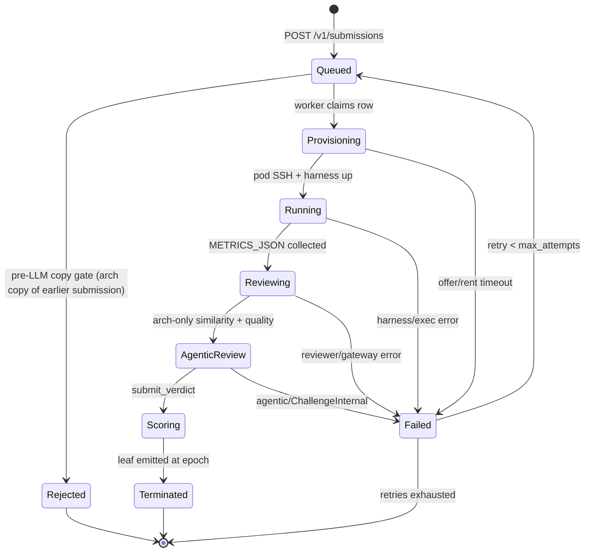

# PRISM challenge (Base)

**challenge_id:** `prism`  
**scoring_version:** `2` (bpb-only; v1 blended a 0.3 LLM quality vote; the architecture competition below reallocates credits *inside* this same lattice — no chain-facing version change)  
**recipe_version:** `1.2.0` (telemetry hooks 1.1.0 + architecture registry / training-only submissions 1.2.0)  
**port:** `8092`  
**emission_share_bps:** `10000` (sole share until design enablement ceremony; then rebalanced with `design`)  
**GPU path:** master-centralized **Lium** (no Phala CVM)

## What it is

PRISM on Base accepts miner two-script submissions (`architecture.py` +
`training.py`) under the official [`recipe v1`](PRISM_RECIPE.md) contract,
plus **training-only submissions** (`training.py` + a published `arch_id`)
for the architecture competition (see below). Each evaluation is executed
for real on a Lium GPU pod rented by the operator master (Sim backend in CI
only). A **pre-LLM copy gate** rejects byte/AST copies of strictly-earlier
architectures (`created_at` ordered) without spending pod or LLM time.
The code is then LLM-reviewed for coherence, then judged for architecture
similarity (**`architecture.py` only** — `training.py` is exempt: the same
training script on two different architectures is legitimate), then run
through the shared **agentic** anti-cheat verifier (`challenge-agentic`:
tools + AST + metrics/receipt; OpenRouter when keyed, `SimAgent` in CI).
The LLM review also enforces the **telemetry contract**: `training.py` must
call `prism_telemetry.report(...)` + `prism_telemetry.finish_evaluation()`;
missing hooks are a hard contract violation (`missing_telemetry_hooks` →
`Score(0)`, terminal). Cheap review/similarity stay as first filters;
agentic is the primary anti-cheat judge. The LLM quality vote is a
**coherence gate, never a grader**: the final score is pure bpb, with
hard-zero on agentic `cheat`/`suspicious` and cheap `Copied`/`Suspicious`.
Missing agentic verdict is fail-closed (`ChallengeInternal`). Leaves are
D24-complete at the exact live chain epoch for gateway ingest. Review
findings are audit events, not points.

This is **not** agent-challenge Phala/TDX attestation and **not**
hypertraining B300 tournament code.

## Orchestration state machine



All transitions are append-only events in `prism_stage_event`; the row state
lives in `prism_submission`. The sweeper fails rows stuck past the 7h grace
as `ChallengeInternal`, and `recover_on_boot` cleans pods referenced by
interrupted rows.

Evaluation (Lium / Sim, review, agentic, leaf emit) is **master-only**.
Validators never run `prism-challenge` — they fetch sealed weights only.

## Submission gating (shared with design)

Intake requires the miner hotkey **in the metagraph** (cached snapshot) and
enforces **one accepted submission per `(prism, hotkey)`**
(`submission_gating` table): non-`open` rows → `409 submission_gated`;
unknown hotkey → `403 hotkey_not_in_metagraph`. Infra-class failures
(`install` = Lium/pod, `ast_infra` = similarity, `llm_infra` = review/agentic)
**auto-retry up to 3 times** before a terminal `blocked`; cheat / suspicious
verdicts are terminal `rejected` (no retry). A metagraph **watcher** reopens
eligibility when the hotkey leaves the metagraph (uid deregistered or hotkey
replaced). Manual `POST /v1/submissions/{id}/retry` is unchanged.

**Training-only entries** gate separately under the composite challenge key
`prism:train:<arch_id>`: one accepted entry per `(hotkey, arch_id)`, with
the same auto-retry classes, the same terminal `rejected`/`blocked` states,
and the same watcher resets (reconciliation is prefix-scoped, so `prism`
covers every `prism:train:*` row). Idempotency stays the contract-bytes
`submission_id`: resubmitting identical bytes is an `already-queued` no-op,
never a gate conflict.

## Architecture registry + competition

Since recipe **1.2.0**, PRISM is an **architecture competition**, not only a
training tournament.

**Registry (`prism_architecture`, migration 0010).** An architecture becomes
*published* — referenceable by other miners — only after its owning
submission survived every gate (copy gate, LLM review, agentic) and reached
`terminated` with a real measured score. Rejected/cheated architectures
never publish. `arch_id = arch_<first 16 hex of sha256(architecture_py)>`;
the full digest is unique (simultaneous identical architectures share the
first registration; the copy gate makes later copies terminal anyway).

**Training-only submissions.** Body: `training.py` + `arch_id`
(`architecture_py` empty — source is pulled from the registry at intake and
denormalized onto the row; ZIP path: `training.py`-only archive +
`X-Prism-Arch-Id` header). Unknown `arch_id` → `404 unknown_arch`; inline
source with `arch_id` → `400`. Training-only rows **skip** the copy gate and
the similarity judgment (their architecture is registry-identical by design)
and are exempt from the agentic corpus-copy check against their own arch;
the telemetry-hooks rule and metrics forge checks still apply. Gating:
`prism:train:<arch_id>` as above — one accepted entry per
`(hotkey, arch_id)`, retries same rules.

**Competition scoring (epoch-local, SCORE_MAX lattice preserved; prism
`SCORING_VERSION` stays 2 — the competition reallocates credits inside the
existing lattice, it does not change leaf format).** Per epoch:

- *challenger credit*: a hotkey's own best lattice score across its rows
  (its own best training result per arch, then across archs).
- *architecture-owner credit*: each registered arch's best epoch result
  (`max(Score)` over all rows linked to that arch, any trainer) is credited
  to the arch's **owner** — owners are rewarded when anyone trains well on
  their architecture.
- *emission*: per hotkey `max(own credits, owner credits)` — **max, never
  summed**, so the lattice bound and the no-double-count property hold by
  construction. `Score(0)` rows (cheat/copy-gate) never set an arch's best;
  hotkeys whose rows are all `NoScore` keep their absence.

**Top-model publish.** The master tracks the global best bpb across all
scored submissions. On a new global best (≤ best ever and < last published),
it publishes `architecture.py` + `training.py` + `METRICS.json` + a
`README.md` block to the public
[`BaseIntelligence/prism`](https://github.com/BaseIntelligence/prism) repo
under `top-model/` via the GitHub contents API, and journals the publication
(`prism_topmodel_publication`). The token is read from the deploy secret
file `PRISM_TOPMODEL_GITHUB_TOKEN_FILE` (`deploy/secrets/github/token`);
absent/empty → publishing is a graceful no-op, scoring is unaffected.

## Agentic anti-cheat + AST + metrics gate

Before any pod or LLM spend, the **pre-LLM copy gate** compares the
candidate `architecture.py` against recent submissions (byte hash +
`challenge-ast` fingerprints): a byte/AST copy of a **strictly-earlier**
submission (`created_at` ordered) is terminal `rejected` with `Score(0)` —
no pod, no LLM. Ties / unknown timestamps fall through to the LLM path; the
published baseline is exempt (miners start from it). After measure and the
cheap `prism-review` arch-only similarity/quality filters, the shared
`challenge-agentic` loop inspects miner sources with read-only tools
(`list_dir`, `read_file`, `ast_summary`, `ast_diff_nearest`, `read_metrics`)
against an **architecture-only** corpus of baseline + recent submissions.
Final judge is the mandatory `submit_verdict` function-call.

| Verdict | Leaf effect |
|---------|-------------|
| `clean` | proceed; score = pure bpb on `[0, SCORE_MAX]` |
| `suspicious` / `cheat` | `Score(0)` via `combine_final` |
| missing / unparseable | `NoScore(ChallengeInternal)` (fail-closed) |

Cheat taxonomy (Prism-relevant):

| Code | Meaning |
|------|---------|
| `inconsistent_metrics` | bpb impossible vs tokens/wall_clock/receipt |
| `eval_short_circuit` | harness short-circuits eval / hardcodes `METRICS_JSON` |
| `ast_architecture_copy` | AST copy of another miner's architecture |
| `near_identical_harness_copy` | Near-identical corpus copy |
| `missing_telemetry_hooks` | `training.py` does not call `prism_telemetry.report` + `finish_evaluation` |

Cheap `Copied` / `Suspicious` from single-shot similarity remain hard-zero
first filters; agentic is the **primary** anti-cheat judge. LLM quality stays
audit-only for the bpb score (coherence gate, never a grader).

## Crates

| Crate | Role |
|-------|------|
| `prism-challenge-task` | Identity constants / domains |
| `prism-lium` | Lium REST client, real recipe exec over SSH, `SimLiumBackend`, `EvalReceipt` |
| `prism-recipe` | Contract validation, dataset pin, harness, baseline sources |
| `prism-pipeline` | Intake contract (validation, `arch_id` rules, gating keys) + eval pipeline |
| `prism-review` | OpenRouter LLM (quality + arch-only similarity) + deterministic sim fallback |
| `challenge-agentic` | Tool-calling anti-cheat (AST + metrics); `SimAgent` for CI |
| `prism-store` | `PrismStore` trait (submissions + arch registry + top-model journal) |
| `prism-registry` | Competition emission math, post-score hooks, top-model GitHub publisher |
| `prism-challenge` | API surface, orchestrator, scoring v2, D24 leaves, gateway client |
| `bins/prism-challenge` | Operator binary `:8092` (backend/reviewer/agentic/store selection) |

## API

| Route | Purpose |
|-------|---------|
| `POST /v1/submissions` | Accept a submission (idempotent by `submission_id`); training-only via `arch_id` + `training.py` |
| `GET /v1/submissions` | List (filter `?status=`, `?miner=`) — rows carry `arch_id` |
| `GET /v1/submissions/{id}` | Full detail + receipt + scores |
| `GET /v1/submissions/{id}/events` | Append-only transition timeline |
| `GET /v1/architectures` | Published architecture registry (owner, digest, per-arch best bpb) |
| `GET /v1/status` | Backend mode, epoch, queue depths, recipe pin |
| `GET /v1/jobs` | One row per active/recent pod (ops) |
| `GET /v1/recipe` | Recipe descriptor (pinned URL/sha, budget, caps) |
| `GET /v1/recipe/baseline` | Baseline `architecture.py` / `training.py` |
| `GET /health` | Liveness |

Miners have **full read access to the recipe**: the dataset pin, the budget,
the harness semantics listed above, and the baseline sources they may reuse.

## Operator backends (fail-closed selection)

`bins/prism-challenge` picks at boot and reports it via `/v1/status`:

| Dimension | Real | Fallback |
|-----------|------|----------|
| Eval backend | `LIUM_API_KEY(_FILE)` present → Lium pods | `SimLiumBackend` |
| Reviewer | `/run/base/openrouter/api_key` exists → OpenRouter LLM | `SimReviewer` (deterministic) |
| Agentic | same OpenRouter key → `OpenRouterAgent` | `SimAgent` (AST + metrics heuristics) |
| Store | `BASE_DATABASE_URL` set → Postgres w/ migrations | in-memory (dev only) |

Nothing is ever invented: a missing pod/run/reviewer means
`ChallengeInternal` → the leaf is `NoScore`, not a fabricated reward.

## Run (sim / local)

```bash
export BASE_CHALLENGE_SK_FILE=deploy/secrets/challenge_sk
cargo run -p prism-challenge-bin -- identity
cargo run -p prism-challenge-bin -- serve --bind 127.0.0.1:8092
curl -s http://127.0.0.1:8092/v1/status
```

## Live staging/operator posture

- compose `prism-challenge` mounts `lium` + `openrouter` secrets dirs and
  loads `deploy/env/prism-challenge.env` (`BASE_DATABASE_URL`, `BASE_NETUID`).
- Ordering rule intake: register
  `{ "challenge_id": "prism", "base_url": "http://prism-challenge:8092", "weight": 1 }`
  with the gateway **after every redeploy** (registry is rebuilt on redeploy).
- OpenRouter key: drop a valid key into
  `deploy/secrets/openrouter/api_key` (mode 0400, uid 65532) — without it the
  similarity/quality votes stay deterministic-sim (documented posture).

## Lium marketplace ops (probed 2026-08-02)

Hard-won facts from the first live waves. All probes happened against real
offers and were committed to the repo as template revisions v1→v9.

### Image/kernel matrix (what provably works)

| Image | Boot | Pod ssh | Verdict |
|-------|------|---------|---------|
| `pytorch/pytorch:*` | ✓ | no sshd at all | unusable |
| `nvidia/cuda:12.4.1-*` | CREATION_FAILED on 4/4 probed nodes | — | unusable |
| `daturaai/pytorch:2.12.0-py3.12-cuda12.8-devel-ubuntu24.04-dind` | ✓ | dies ~90 s after start | unusable |
| `daturaai/pytorch:2.12.0-py3.12-cuda13.0.2-devel-ubuntu24.04-dind` | ✓ | stable ≥ 7 min (verify + exec) | **recipe template v9** |

Why cu12.8-DinD dies: its image starts no sshd by itself, so the template
runs `service ssh start` — a *job* that finishes and whose supervising phase
then kills the forked sshd. The cu**13.0.2** tag runs sshd from its own init
without any startup command; Lium's own verified public template
(`Pytorch (Cuda + DinD)`) proves the same shape. Rule: **keep
`startup_commands` EMPTY** on this template.

### `startup_commands` filter (API-side)

Rejected anywhere in the string: `& ; | $ ( ) { } < > ` `` ` `` `\n` and
chaining forms; quoting is tolerated (the original recipe template stored
`"pkg==x.y."` values fine); banned tokens behave like a word denylist
(e.g. `exec`, `ls`). Accepted shapes: bare commands with flags and paths
(`pip install --quiet torch`), `bash -c true`, `sleep N`, `wait true`. The
`/templates` API is rate-limited to **20 POST/hour** — probe budget counts.

### Provision failure modes (handled in `prism-lium`)

- `CREATION_FAILED` despite PENDING: offer-specific image/node pairing
  flakes → wait-inside-provision, cleanup, march to the next candidate.
- `Provider doesn't allow GPU splitting`: retry the whole node immediately
  (`gpu_count` = offer's count; per-GPU price is unchanged, so the price cap
  check is untouched).
- Market thinness: candidates widened to the **10** cheapest fitting offers.
- Pod lifetime truth: API `/pods/{id}` + port in `ssh_connect_cmd`; the
  `/pods/{id}/logs` endpoint is the debugging source of truth.

### Exec phase on the recipe image

The DinD devel image already ships `torch 2.12.0+cu130` — **do not reinstall
torch** (pinning 2.4.1 drags cu121 `nvidia-*` wheels onto a cu130 host and
breaks the resolved environment). The exec script guards per package and
installs only missing eval deps (`transformers==4.44.2`, `datasets==3.0.2`,
`pyarrow==17.0.0`) with `--break-system-packages` (PEP 668).

### Cost baseline

Full three-submission proof wave (3 end-to-end runs with training and
scoring) plus ~14 failed provision attempts across the debugging marathon:
**$0.97** total wallet delta — far under the $2/target evidence budget and
the per-submission $2.5/h cost guard.

## Tests

```bash
cargo test -p prism-challenge-task -p prism-lium -p prism-recipe \
  -p prism-review -p prism-store -p prism-challenge -p prism-challenge-bin
```

Wiremocks: Lium REST client (offers/rent) + OpenRouter chat roundtrip.
Sim orchestrator e2e: claim → run → review → score → exact-E leaf dry-run.

## Must not

- Phala CVM / TDX path for PRISM GPUs
- Non-zero emission without ceremony
- Move emission bps without owner trust-root ceremony (see [`runbooks/design-enable-and-emission.md`](./runbooks/design-enable-and-emission.md))
- Commit `LIUM_API_KEY`, OpenRouter keys, or challenge secrets
