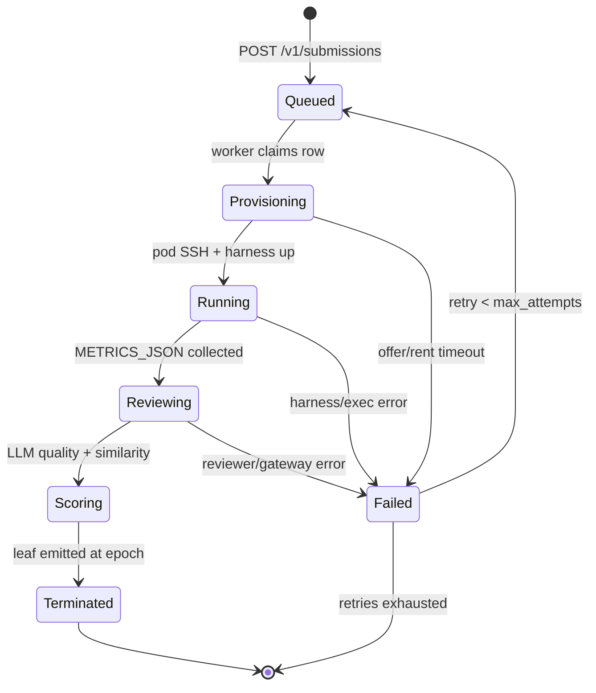

# PRISM challenge (Base)

**challenge_id:** `prism`  
**scoring_version:** `2` (pb-only; v1 blended a 0.3 LLM quality vote)  
**port:** `8092`  
**emission_share_bps:** `0` (until owner ceremony)  
**GPU path:** master-centralized **Lium** (no Phala CVM)

## What it is

PRISM on Base accepts miner two-script submissions (`architecture.py` +
`training.py`) under the official [`recipe v1`](PRISM_RECIPE.md) contract.
Each evaluation is executed for real on a Lium GPU pod rented by the
operator master (Sim backend in CI only), then the code is LLM-reviewed for
coherence and similarity to the baseline + all prior submissions. The LLM
review is a **coherence / anti-cheat gate, never a grader**: the final
score is pure bpb, with hard-zero on `Copied`/`Suspicious` verdicts, and
emit D24-complete signed leaves at the exact live chain epoch for gateway
ingest. Review findings are stored as audit events, not points.

This is **not** agent-challenge Phala/TDX attestation and **not**
hypertraining B300 tournament code.

## Orchestration state machine



All transitions are append-only events in `prism_stage_event`; the row state
lives in `prism_submission`. The sweeper fails rows stuck past the 7h grace
as `ChallengeInternal`, and `recover_on_boot` cleans pods referenced by
interrupted rows.

## Crates

| Crate | Role |
|-------|------|
| `prism-challenge-task` | Identity constants / domains |
| `prism-lium` | Lium REST client, real recipe exec over SSH, `SimLiumBackend`, `EvalReceipt` |
| `prism-recipe` | Contract validation, dataset pin, harness, baseline sources |
| `prism-review` | OpenRouter LLM (quality + similarity) + deterministic sim fallback |
| `prism-store` | `PrismStore` trait, `MemoryPrismStore`, `DbPrismStore` (SQL) |
| `prism-challenge` | API surface, orchestrator, scoring v2, D24 leaves, gateway client |
| `bins/prism-challenge` | Operator binary `:8092` (backend/reviewer/store selection) |

## API

| Route | Purpose |
|-------|---------|
| `POST /v1/submissions` | Accept a submission (idempotent by `submission_id`) |
| `GET /v1/submissions` | List (filter `?status=`, `?miner=`) |
| `GET /v1/submissions/{id}` | Full detail + receipt + scores |
| `GET /v1/submissions/{id}/events` | Append-only transition timeline |
| `GET /v1/status` | Backend mode, epoch, queue depths, recipe pin |
| `GET /v1/jobs` | One row per active/recent pod (ops) |
| `GET /v1/recipe` | Recipe descriptor (pinned URL/sha, budget, caps) |
| `GET /v1/recipe/baseline` | Baseline `architecture.py` / `training.py` |
| `GET /health` | Liveness |

Miners have **full read access to the recipe**: the dataset pin, the budget,
the harness semantics listed above, and the baseline sources they may reuse.

## Operator backends (fail-closed selection)

`bins/prism-challenge` picks at boot and reports it via `/v1/status`:

| Dimension | Real | Fallback |
|-----------|------|----------|
| Eval backend | `LIUM_API_KEY(_FILE)` present → Lium pods | `SimLiumBackend` |
| Reviewer | `/run/base/openrouter/api_key` exists → OpenRouter LLM | `SimReviewer` (deterministic) |
| Store | `BASE_DATABASE_URL` set → Postgres w/ migrations | in-memory (dev only) |

Nothing is ever invented: a missing pod/run/reviewer means
`ChallengeInternal` → the leaf is `NoScore`, not a fabricated reward.

## Run (sim / local)

```bash
export BASE_CHALLENGE_SK_FILE=deploy/secrets/challenge_sk
cargo run -p prism-challenge-bin -- identity
cargo run -p prism-challenge-bin -- serve --bind 127.0.0.1:8092
curl -s http://127.0.0.1:8092/v1/status
```

## Live staging/operator posture

- compose `prism-challenge` mounts `lium` + `openrouter` secrets dirs and
  loads `deploy/env/prism-challenge.env` (`BASE_DATABASE_URL`, `BASE_NETUID`).
- Ordering rule intake: register
  `{ "challenge_id": "prism", "base_url": "http://prism-challenge:8092", "weight": 1 }`
  with the gateway **after every redeploy** (registry is rebuilt on redeploy).
- OpenRouter key: drop a valid key into
  `deploy/secrets/openrouter/api_key` (mode 0400, uid 65532) — without it the
  similarity/quality votes stay deterministic-sim (documented posture).

## Lium marketplace ops (probed 2026-08-02)

Hard-won facts from the first live waves. All probes happened against real
offers and were committed to the repo as template revisions v1→v9.

### Image/kernel matrix (what provably works)

| Image | Boot | Pod ssh | Verdict |
|-------|------|---------|---------|
| `pytorch/pytorch:*` | ✓ | no sshd at all | unusable |
| `nvidia/cuda:12.4.1-*` | CREATION_FAILED on 4/4 probed nodes | — | unusable |
| `daturaai/pytorch:2.12.0-py3.12-cuda12.8-devel-ubuntu24.04-dind` | ✓ | dies ~90 s after start | unusable |
| `daturaai/pytorch:2.12.0-py3.12-cuda13.0.2-devel-ubuntu24.04-dind` | ✓ | stable ≥ 7 min (verify + exec) | **recipe template v9** |

Why cu12.8-DinD dies: its image starts no sshd by itself, so the template
runs `service ssh start` — a *job* that finishes and whose supervising phase
then kills the forked sshd. The cu**13.0.2** tag runs sshd from its own init
without any startup command; Lium's own verified public template
(`Pytorch (Cuda + DinD)`) proves the same shape. Rule: **keep
`startup_commands` EMPTY** on this template.

### `startup_commands` filter (API-side)

Rejected anywhere in the string: `& ; | $ ( ) { } < > ` `` ` `` `\n` and
chaining forms; quoting is tolerated (the original recipe template stored
`"pkg==x.y."` values fine); banned tokens behave like a word denylist
(e.g. `exec`, `ls`). Accepted shapes: bare commands with flags and paths
(`pip install --quiet torch`), `bash -c true`, `sleep N`, `wait true`. The
`/templates` API is rate-limited to **20 POST/hour** — probe budget counts.

### Provision failure modes (handled in `prism-lium`)

- `CREATION_FAILED` despite PENDING: offer-specific image/node pairing
  flakes → wait-inside-provision, cleanup, march to the next candidate.
- `Provider doesn't allow GPU splitting`: retry the whole node immediately
  (`gpu_count` = offer's count; per-GPU price is unchanged, so the price cap
  check is untouched).
- Market thinness: candidates widened to the **10** cheapest fitting offers.
- Pod lifetime truth: API `/pods/{id}` + port in `ssh_connect_cmd`; the
  `/pods/{id}/logs` endpoint is the debugging source of truth.

### Exec phase on the recipe image

The DinD devel image already ships `torch 2.12.0+cu130` — **do not reinstall
torch** (pinning 2.4.1 drags cu121 `nvidia-*` wheels onto a cu130 host and
breaks the resolved environment). The exec script guards per package and
installs only missing eval deps (`transformers==4.44.2`, `datasets==3.0.2`,
`pyarrow==17.0.0`) with `--break-system-packages` (PEP 668).

### Cost baseline

Full three-submission proof wave (3 end-to-end runs with training and
scoring) plus ~14 failed provision attempts across the debugging marathon:
**$0.97** total wallet delta — far under the $2/target evidence budget and
the per-submission $2.5/h cost guard.

## Tests

```bash
cargo test -p prism-challenge-task -p prism-lium -p prism-recipe \
  -p prism-review -p prism-store -p prism-challenge -p prism-challenge-bin
```

Wiremocks: Lium REST client (offers/rent) + OpenRouter chat roundtrip.
Sim orchestrator e2e: claim → run → review → score → exact-E leaf dry-run.

## Must not

- Phala CVM / TDX path for PRISM GPUs
- Non-zero emission without ceremony
- Touch agent-v1 freeze or move its bps without explicit owner order
- Commit `LIUM_API_KEY`, OpenRouter keys, or challenge secrets
