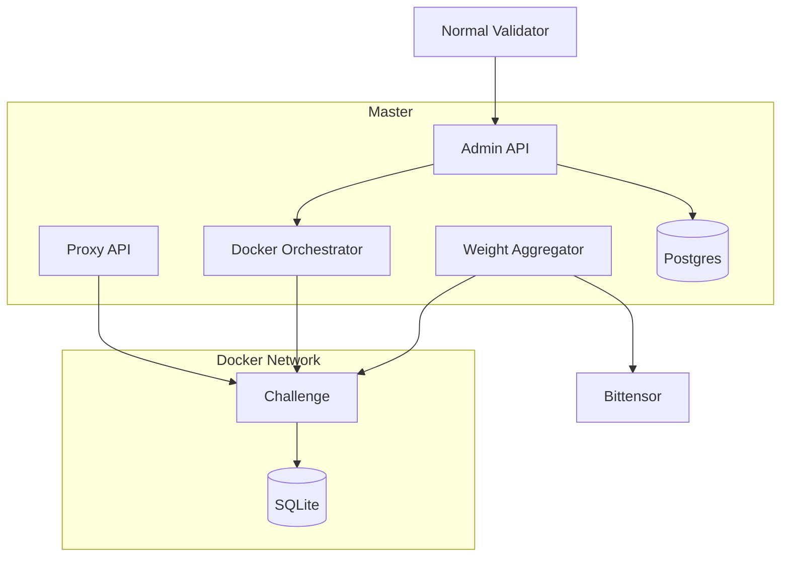

# Architecture

## Components

## Master validator

The master owns registry metadata, admin operations, Docker lifecycle, challenge tokens, emission configuration, and final Bittensor weight submission.

## Normal validator

Normal validators read `/v1/registry`, launch all active challenge images locally, and keep retrying if the registry is unavailable.

## Challenge isolation

Each challenge runs in Docker with its own image, named SQLite volume, internal shared token, and public routes behind the Platform proxy.
