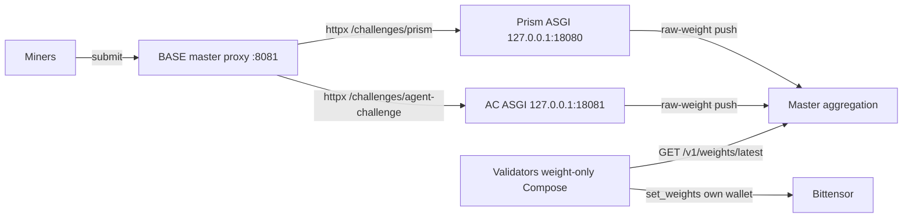
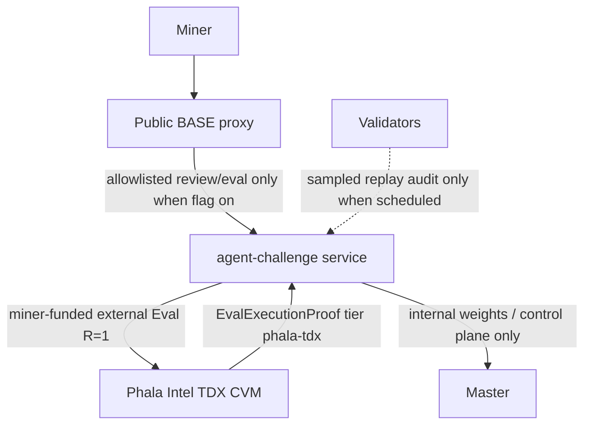

# Architecture


BASE runs as a **single-host Docker Compose** topology. Compose is the only supported
shipping runtime for new installs. There is no Helm chart, no Kubernetes manifests,
and no `runtime.backend` selector that switches to Swarm: the target backend is Compose.

Historical `deploy/swarm/` material is retained only as an unsupported reference. Do not
use `install-swarm.sh`, `docker service`, or `docker stack` for greenfield installs.

## Coordination flow



```text
miners/FE → chain.joinbase.ai → base-master-validator:8081
                                  ├─ /v1/weights/latest
                                  ├─ /challenges/prism/* → 127.0.0.1:18080
                                  └─ /challenges/agent-challenge/* → 127.0.0.1:18081

validators (N) → GET weights only → set_weights
```

Miners reach challenges through the master public proxy on the **unchanged** public
prefixes `/challenges/prism` and `/challenges/agent-challenge`. Challenges run as
**localhost uvicorn processes inside the master container** (supervisor + httpx reverse
proxy), not as separate Compose services. Each challenge owns scoring and state, then
**pushes** authenticated raw hotkey weights to the master. The master persists snapshots,
aggregates a final vector, and serves it. **Validators are weight-only by default**: they
fetch `GET /v1/weights/latest` from `https://chain.joinbase.ai` and submit with their own
wallet. They do **not** write submissions/leaderboards or host challenge control-plane.
The master **never** constructs or invokes `set_weights`.

There is **no LLM gateway** in the target path. Challenge admission and scoring belong to
each embedded challenge ASGI (Prism is deterministic / provider-trust). Application code
does **not** launch evaluator containers; external long-lived TEE evaluation (agent-challenge
Phala path when enabled) is verified and ingested, not orchestrated as --rm jobs by Base.

## Master Compose project

The master project (`deploy/compose/docker-compose.yml`, installer
`deploy/compose/install-master.sh`) hosts:

| Service | Role |
| --- | --- |
| `base-master-validator` | Public proxy (`0.0.0.0:8081`), coordination, raw-weight ingress, aggregation, health/version; **embeds** Prism + agent-challenge ASGI via `docker/master-entrypoint.sh` |
| `master-postgres` | Durable control-plane PostgreSQL (private network only) |

Exact cardinality is **one application container and one PostgreSQL container**. There is
**no** `challenge-prism` / `challenge-agent-challenge` Compose service, no gateway sidecar,
no challenge PostgreSQL, no evaluator service, and no Swarm broker overlay.

| Process (inside master) | Bind | Notes |
| --- | --- | --- |
| `base master proxy` | `0.0.0.0:8081` | Public API + `/challenges/*` reverse proxy (httpx) |
| Prism ASGI | `127.0.0.1:18080` | `uvicorn prism_challenge.app:app` |
| Agent-challenge ASGI | `127.0.0.1:18081` | `uvicorn agent_challenge.app:app` |

Registry seed / `default_internal_base_url` use loopback only:

- Prism: `http://127.0.0.1:18080`
- agent-challenge: `http://127.0.0.1:18081`

Master is the **sole writer** of control-plane and challenge-facing aggregation surfaces.
Challenge SQLite lives under the master volume
(`/var/lib/base/challenges/{prism,agent-challenge}`); there is **no multi-writer SQLite**
across containers. Shared tokens remain file-backed
(`PRISM_SHARED_TOKEN_FILE`, `CHALLENGE_SHARED_TOKEN_FILE`).

Master config and secrets are host files (mode `0600`, parent dirs `0700`) bind-mounted
read-only. Compose manifests never embed secret values. The control-plane database URL is
private to the master process.

Networks:

- `db` (internal): master + PostgreSQL only; no host publication of `5432`.
- `app` (internal): available for attachments; challenges bind loopback inside master (not separate Compose peers).
- `public` (non-internal): master host API only (operators typically bind loopback in
  the `3100-3199` test range; production should put a reverse proxy in front).

## Independent validators

Each validator is an **independent Compose project**
(`deploy/compose/docker-compose.validator.yml`, installer
`deploy/compose/install-validator.sh`). Shipping default is **weight-only**:
`--master-url https://chain.joinbase.ai`, `challenge_execution_enabled: false`, no
assignment execute path against challenge writers. Validators fetch the final weight
vector and may submit on-chain with their own hotkey when gated on. They never receive
master PostgreSQL credentials, challenge volumes, aggregation controls, or challenge
lifecycle operators. Host `docker.sock` on the agent (when mounted) is optional migration
prep only — not a challenge control-plane. Teardown of one validator project does not
affect another or the master.

## Challenge isolation (embedded)

Active challenges are **localhost ASGI processes inside the master image**, not separate
Compose services. Each challenge package is installed into `base-master` from the monorepo
(`packages/challenges/{prism,agent-challenge}`), shares file-backed tokens with the
registry, exposes public routes only behind the proxy prefixes above, and stores SQLite /
artifacts under `/var/lib/base/challenges/<slug>` on the master volume.

Challenge state is SQLite on that path (not a second container volume pair). BASE
provisions no Postgres server per challenge; each challenge never receives a
control-plane database credential. Master volume retention follows the master backup /
teardown scripts; purge is an explicit operator action.

Emergency dual-run (proxy-only master + external `challenge-*` container) is
**operator-only**: set `BASE_MASTER_EMBED_CHALLENGES=0`, override registry
`internal_base_url`, and restore a challenge service file. It is **not** the shipping
default.

## Challenge watcher / reconcile (shipping default off)

With embedded challenges there is no separate challenge Compose service to pull or
recreate. Shipping install sets watcher and registry reconcile intervals to **0** so
master health does not depend on missing `challenge-*` services. Auto-update of the
**master image** (which contains the challenge packages) is the primary roll path;
historical GHCR challenge image names remain for emergency dual-run / rollback only.

When re-enabled for emergency dual-run, the master-resident Compose watcher still:

1. Resolves an approved **immutable** image reference (`repository@sha256:<64 hex>`).
2. Records current vs desired digest and durable rollout intent.
3. Controlled pull of the desired image.
4. Targeted recreate of only the affected Compose service (project-scoped).
5. Health and version verify.
6. On failure, restores the previous digest with **bounded backoff**.

The watcher never creates evaluator containers, never calls `docker service` / Swarm
APIs, and only mutates services inside the configured Compose project boundary.

Operator install and deeper cardinality rules: [Compose-only deployment](compose.md) and
[Deploy from scratch](deploy.md).

## Weight protocol

1. A challenge computes a raw hotkey-weight snapshot.
2. It pushes a versioned payload to the master's private authenticated ingress.
3. The master validates challenge binding, rejects malformed / replayed / stale payloads,
   and persists the snapshot.
4. Duplicate deliveries of the same epoch/revision are idempotent.
5. The master normalizes, applies emission shares, maps hotkeys to UIDs, applies
   burn/zero-miner policy, and serves a final vector.
6. Validators fetch that vector and submit independently.

## Out of scope / unsupported

- Docker Swarm for new installs (`deploy/swarm/`, `install-swarm.sh`, overlays, Swarm
  secrets, replicated jobs, placement constraints, `docker service` / `docker stack`)
- LLM gateway services, tokens, routes, and provider clients
- Application-launched evaluator containers (`docker run`, `docker compose run` jobs)
- Helm / Kubernetes
- Per-challenge Postgres servers managed by BASE
- Automated destructive challenge purge without explicit operator action

## Agent Challenge Phala Intel TDX path

Agent Challenge attestation is **separate from the PRISM miner-funded GPU worker plane**. BASE owns the shared proof, proxy, and assignment surfaces below; end-to-end self-deploy review→eval, RA-TLS key release, and score acceptance live in the agent-challenge service when its own attestation flags are on (cross-repo challenge docs are available after PR merge).

### Flag-off vs flag-on

| Surface | Flag off (default) | Flag on |
|---------|--------------------|---------|
| Master setting | `master.agent_challenge_attested_routes_enabled=false` | `master.agent_challenge_attested_routes_enabled=true` |
| Public proxy | Legacy signed submission / env / launch passthrough | Fail-closed **allowlist** of review/eval + status/SSE + benchmark metadata only |
| Evaluation ownership | Legacy R=1 `own_runner` on validators (reassign on failure, never multi-replica) | Full attested mode: **one miner-funded external eval (R=1)**; BASE creates **zero** agent-challenge validator assignment, retry, replica, reconciliation, audit, or fold rows for those units |
| Phala verifier | Not required on agent-challenge results | Challenge/operators use BASE Phala-tier schema + quote helpers; BASE does not invent challenge-side score policy |

Legacy path is byte-identical when the master attested-routes flag stays off. PRISM worker-plane replication (default R=2, `compute.replication_factor`) is unchanged either way.



### Public vs private challenge proxy boundary

Public clients reach challenges only at `/challenges/{slug}/...`. The proxy always blocks:

- `/internal/*`, `/health`, `/version`
- Generic benchmark-execution-shaped paths (for example `/benchmark-executions` and benchmark `run` / `execute` / `launch` leaves)

With **attested routes enabled**, agent-challenge is additionally **allowlist fail-closed** (`src/base/master/app_proxy.py`): only the exact signed review/eval rows, signed `POST /submissions`, `GET .../status` and `GET .../events`, and `GET /benchmarks/tasks` are forwardable. Capability, assignment, evidence, key-release, direct result ingestion, results aliases, env/launch (legacy), wrong methods, neighboring paths, and non-canonical raw path bytes are denied **locally** (404 before any upstream call). Private routes must never fall through the public proxy.

On allowlisted agent-challenge routes the proxy:

- Preserves miner signature headers `X-Hotkey`, `X-Signature`, `X-Nonce`, `X-Timestamp` where the miner signs the challenge-local path
- Strips hop-by-hop, internal, and attested trust-shaped headers/prefixes (for example `x-base-*`, `x-attestation-*`, `x-ra-tls-*`, client-IP spoofs) so edge clients cannot inject trust

### ExecutionProof Phala tier (BASE schema)

Every worker/eval proof envelope is the shared `ExecutionProof` model in `src/base/schemas/worker.py`:

- Integer tiers **0 / 1 / 2** remain the PRISM worker-plane tiers (manifest + sr25519; image digest; optional in-guest attestation).
- Phala Intel TDX uses string tier **`phala-tdx`** (`PHALA_TDX_TIER`), with an `attestation` block (`PhalaAttestation` / strict `EvalPhalaAttestation`).
- Canonical **Eval** wire equals schema-closed `EvalExecutionProof` (version 1, tier `phala-tdx`, digest-pinned `image_digest`, empty worker-signature placeholders for validator rebind, no extra fields).
- Bound examples (fail closed at parse): TDX quote ≤ 64 KiB, event log ≤ 4096 entries / 2 MiB, **`vm_config` ≤ 256 KiB** (`EVAL_MAX_VM_CONFIG_BYTES`), closed `vm_config` fields `{vcpu, memory_mb, os_image_hash}`.
- Measurement registers use fixed hex widths; `report_data` is 64-byte (128 hex) left-aligned binding with domain tag `base-agent-challenge-v1` (`src/base/worker/proof.py`).

### Quote verify and park vs reject

BASE quote helpers (`src/base/worker/phala_quote.py`, `phala_verify.py`, `proof.py`) verify Phala-tier proofs:

1. **Tier-0** worker (or rebound) signature over `sha256("{manifest_sha256}:{unit_id}")` always required.
2. Quote structure + RTMR3 event-log replay from the hardware-signed TD report (compose bound by content, not trusted by value).
3. Cryptographic DCAP verification via the **`dcap-qvl`** CLI: quote bytes are written to a **temp file** and passed by path (not as an inline argv hex body).
4. Measurement must match a non-empty validator **allowlist** (fail-closed when empty or unloaded).
5. Nonce freshness via validator-issued state; acceptable TCB default includes `UpToDate`.

Outcomes:

- Cryptographic / structure failure → **reject**
- Transient `dcap-qvl` missing, timeout, exit-0 non-JSON, or missing TCB status → **park** (`VerifierUnavailableError`): never accept, never permanent fraud-reject

BASE does not claim perfect hardware trust. Treat Phala as **cryptographically-anchored trust-but-audit**; residual TEE and collateral risks remain (see [Security](security.md)).

### Replay audit seam

Sampled validator replay audits for agent-challenge use the labelled transport in `src/base/master/replay_audit.py` (`agent-challenge.replay-audit.v1`). Requests carry the complete immutable Eval plan; plan digests and trial scores are validated on the BASE wire before forward or accept. This is not ordinary multi-replica worker reconciliation.
