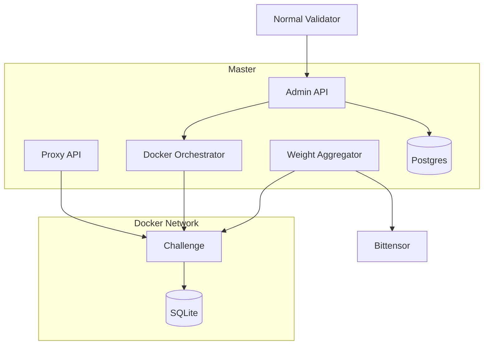

# Architecture

## Components

## Master validator

The master owns registry metadata, admin operations, Docker lifecycle, challenge tokens, emission configuration, and final Bittensor weight submission.

## Normal validator

Normal validators read `/v1/registry`, launch all active challenge images locally, and keep retrying if the registry is unavailable.

## Challenge isolation

Each challenge runs in Docker with its own image, named SQLite volume, internal shared token, and public routes behind the Platform proxy. Public proxy paths block internal challenge routes. Broker archive inputs are untrusted and are validated before extraction or resource creation. Kubernetes broker cleanup attempts to remove the Job, NetworkPolicy, and mount Secret on success and failure paths.

## Deployment Boundaries

Local Compose, staging Compose, and production Kubernetes are separate validation surfaces. Watchtower belongs only to the explicit local or staging Compose overlay, uses `nickfedor/watchtower:1.17.1` for Docker 29 API compatibility, and only updates opted-in control-plane services. It must not update challenges, broker-created jobs, databases, or Kubernetes workloads.

Docker socket mounts in local Compose are local control-plane capabilities with host Docker daemon access. Treat `/var/run/docker.sock` as root-equivalent host access, not as production isolation. Production Kubernetes should use Kubernetes rollout controls, scoped RBAC, external PostgreSQL, and semver plus `sha256` digest image pins.

Kubernetes CPU and memory requests and limits map to PodSpec fields. Docker-only `pids_limit`, `memory_swap`, and custom Docker network modes do not have parity in this path, so non-default requests are rejected or handled by cluster and admission policy outside Platform.

Multi-server and Kubernetes target routing trusts only enabled, healthy, non-draining targets with remaining GPU capacity. Production agent targets require HTTPS and `verify_tls=true`; stale or insecure persisted assignments are not trusted under production policy.
