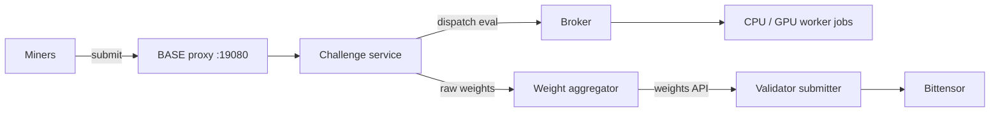

# Architecture

BASE runs as a single Docker Swarm. The manager node owns the control plane; worker nodes run only short-lived evaluation jobs. There is no Helm chart, no Kubernetes manifests, and no `runtime.backend` selector: the only backend is Swarm.

## Coordination flow

Miners reach challenges through the proxy; challenges dispatch evaluation to broker-scheduled worker jobs; the manager aggregates raw challenge weights; the validator submitter reads the computed vector from `/v1/weights/latest` and submits it on-chain.

## Manager node

The manager hosts the platform API (a single proxy on `:19080` serving `/v1/registry`, `/v1/weights/latest`, `/health`, the `/challenges/*` passthrough, and the token-gated admin routes), the broker, the supervisor, and the challenge service containers. Challenge code runs pinned to `node.role==manager`, so the long-lived challenge APIs share the manager node with the control plane.

Master and validator control-plane state share one PostgreSQL-compatible URL (`BASE_DATABASE_URL`). That URL is private to the control-plane process and never reaches challenge containers.

## Worker nodes

Workers run short-lived evaluation jobs only. The broker dispatches them as Swarm replicated jobs (`--restart-condition none`, so an evaluation never auto-restarts):

- CPU jobs are constrained to `node.labels.base.workload==cpu`.
- GPU jobs (broker `gpu_count > 0`) are constrained to `node.labels.base.workload==gpu` and request `--generic-resource NVIDIA-GPU=<N>`.

Workers enroll manually with a Swarm join token (no SSH). On the manager, `base master worker token [--cpu|--gpu]` prints a `docker swarm join --token <TOKEN> <MANAGER_IP>:2377` command; after the join the manager labels the node with `base master worker label <node> --workload cpu|gpu`.

## Submitter

The on-chain submitter is a minimal submit-only process on the validator node. It reads `/v1/weights/latest`, submits the vector on-chain, and retries while the master is unavailable. It runs no challenge orchestration; all challenge services live on the manager.

## Challenge isolation

Each challenge is a Swarm replicated service with its own OCI image, internal shared token, public routes behind the proxy, an encrypted overlay network, and a `/data` Swarm volume. Public proxy paths block internal challenge routes, and untrusted broker archive inputs are validated before extraction or resource creation.

Challenge state is SQLite on the `/data` volume (`sqlite+aiosqlite:////data/challenge.sqlite3`). BASE provisions no Postgres server per challenge; each challenge owns its `/data` volume for the database, artifacts, analyzer output, and local files, and never receives a control-plane database credential. The volume is retained when a challenge service is removed; manual deletion is a destructive, explicit operator purge.

## Deployment topology

First-party BASE deployments are Docker Swarm only. The manager is brought up with `deploy/swarm/install-swarm.sh`, which provisions the master proxy, broker, and challenge services on encrypted overlay networks plus the systemd supervisor unit. Worker nodes are enrolled manually with join tokens and workload labels. There is no Helm chart, no Kubernetes manifests, and no `runtime.backend` selector: the only backend is Swarm.

Pinned production deployments disable mutable auto-update and use rolling service updates, PostgreSQL control-plane state, per-challenge SQLite on `/data`, and semver plus `sha256` digest image pins.

Swarm service resources map CPU and memory to `--limit-cpu` and `--limit-memory`, and PID ceilings to `--limit-pids`. `docker service create` supports neither `--memory-swap` nor `--security-opt`, so swap limits are not emitted and `no-new-privileges` is enforced daemon-wide via `daemon.json`.

### Swarm broker GPU contract

Broker clients request GPUs with `limits.gpu_count`. `None` or an omitted field means CPU-only (no GPU resource emitted); a positive integer becomes the Swarm generic resource `--generic-resource NVIDIA-GPU=<N>`. The name `NVIDIA-GPU` is case-sensitive and must match the `node-generic-resources` advertisement in the worker `daemon.json`.

GPU placement is node labels plus generic resources only. A GPU job is constrained to `node.labels.base.workload==gpu` and acquires a capacity lease before the service is created; the lease is released on cleanup or failure. There is no remote GPU HTTP agent and no device-ID scheduling; device IDs are observability metadata, not scheduling semantics, and this contract claims no TPU, AMD, or custom-accelerator abstraction.

## Out of scope

No Postgres server per challenge, no Docker Compose or stack-file deployment, and no automatic backups, restore workflows, high availability, connection pooling, storage resize workflows, challenge Alembic migration automation, or automated destructive purge.
