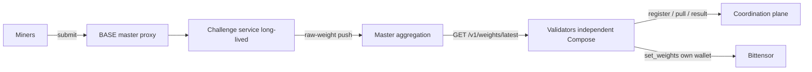

# Architecture

BASE runs as a **single-host Docker Compose** topology. Compose is the only supported
shipping runtime for new installs. There is no Helm chart, no Kubernetes manifests,
and no `runtime.backend` selector that switches to Swarm: the target backend is Compose.

Historical `deploy/swarm/` material is retained only as an unsupported reference. Do not
use `install-swarm.sh`, `docker service`, or `docker stack` for greenfield installs.

## Coordination flow

Miners reach challenges through the master public proxy. Each challenge owns scoring and
state, then **pushes** authenticated raw hotkey weights to the master. The master
persists snapshots, aggregates a final vector, and serves it. **Validators never compute
canonical aggregation**; each independent validator fetches the master vector and submits
it on-chain with its own wallet. The master **never** constructs or invokes `set_weights`.

There is **no LLM gateway** in the target path. Challenge admission and scoring belong to
each challenge service (Prism is deterministic). Application code does **not** launch
evaluator containers; external long-lived TEE evaluation is verified and ingested, not
orchestrated as --rm jobs by Base or Prism.

## Master Compose project

The master project (`deploy/compose/docker-compose.yml`, installer
`deploy/compose/install-master.sh`) hosts:

| Service | Role |
| --- | --- |
| `base-master-validator` | Public proxy, coordination plane, raw-weight ingress, aggregation, health/version, **digest-aware challenge watcher** |
| `master-postgres` | Durable control-plane PostgreSQL (private network only) |
| one `challenge-<slug>` | Long-lived combined challenge service per active challenge |

Exact cardinality is one application container, one PostgreSQL container, and one
long-lived container per active challenge. There is no gateway sidecar, no challenge
PostgreSQL, no evaluator service, and no Swarm broker overlay in this topology.

Master config and secrets are host files (mode `0600`, parent dirs `0700`) bind-mounted
read-only. Compose manifests never embed secret values. The control-plane database URL is
private to the master process and never reaches challenge containers.

Networks:

- `db` (internal): master + PostgreSQL only; no host publication of `5432`.
- `app` (internal): master + challenge services.
- `public` (non-internal): master host API only (operators typically bind loopback in
  the `3100-3199` test range; production should put a reverse proxy in front).

## Independent validators

Each validator is an **independent Compose project**
(`deploy/compose/docker-compose.validator.yml`, installer
`deploy/compose/install-validator.sh`). Validators register and heartbeat with the
master, pull assignments, report results, fetch the final weight vector, and may submit
on-chain with their own hotkey. They never receive master PostgreSQL credentials,
challenge volumes, Docker socket access, aggregation controls, or challenge lifecycle
operators. Teardown of one validator project does not affect another or the master.

## Challenge isolation

Each active challenge is a **long-lived Compose service** with its own OCI image (digest
pin), internal shared token, public routes behind the proxy, membership on the private
`app` network only, and a named `/data` volume for SQLite and artifacts.

Challenge state is SQLite on that volume
(`sqlite+aiosqlite:////data/challenge.sqlite3`). BASE provisions no Postgres server per
challenge; each challenge owns its `/data` volume and never receives a control-plane
database credential. Volumes are retained when a challenge service is stopped or
removed; purge is an explicit operator action on the named volume.

## Digest-aware auto-update (watcher)

Auto-update of challenges is **not** Swarm service mutation of a mutable `latest` tag.
It is the **master-resident Compose challenge watcher** running inside
`base-master-validator`:

1. Resolve an approved **immutable** image reference (`repository@sha256:<64 hex>`).
2. Record current vs desired digest and durable rollout intent.
3. Controlled pull of the desired image.
4. Targeted recreate of only the affected Compose service (project-scoped).
5. Health and version verify.
6. On failure, restore the previous digest with **bounded backoff**; durable state
   survives master restart.

The watcher never creates evaluator containers, never calls `docker service` / Swarm
APIs, and only mutates services inside the configured Compose project boundary.

Operator install and deeper cardinality rules: [Compose-only deployment](compose.md) and
[Deploy from scratch](deploy.md).

## Weight protocol

1. A challenge computes a raw hotkey-weight snapshot.
2. It pushes a versioned payload to the master's private authenticated ingress.
3. The master validates challenge binding, rejects malformed / replayed / stale payloads,
   and persists the snapshot.
4. Duplicate deliveries of the same epoch/revision are idempotent.
5. The master normalizes, applies emission shares, maps hotkeys to UIDs, applies
   burn/zero-miner policy, and serves a final vector.
6. Validators fetch that vector and submit independently.

## Out of scope / unsupported

- Docker Swarm for new installs (`deploy/swarm/`, `install-swarm.sh`, overlays, Swarm
  secrets, replicated jobs, placement constraints, `docker service` / `docker stack`)
- LLM gateway services, tokens, routes, and provider clients
- Application-launched evaluator containers (`docker run`, `docker compose run` jobs)
- Helm / Kubernetes
- Per-challenge Postgres servers managed by BASE
- Automated destructive challenge purge without explicit operator action
