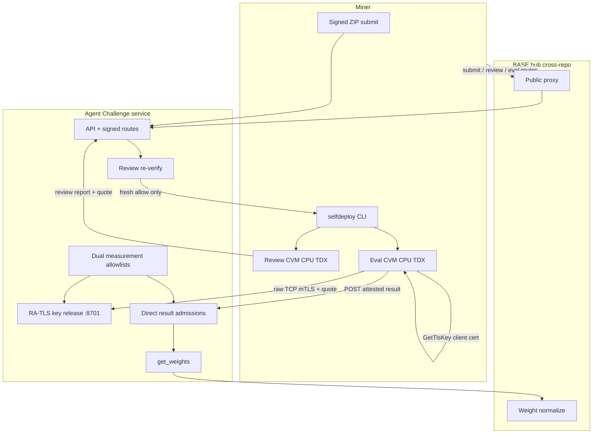
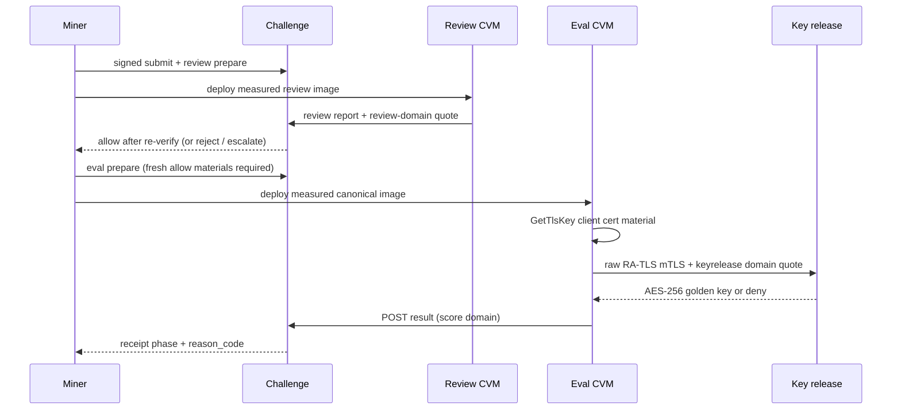

# Architecture

Agent Challenge is a FastAPI service deployed as Docker Swarm services alongside BASE master
(admin, proxy, broker). There is no Kubernetes path. Challenge code and attested runtimes live in
this repository; [BASE](https://github.com/BaseIntelligence/base) provides the public proxy,
registry, weight aggregation, and ExecutionProof carry-through (cross-repo).

## Production flow (mandatory)

Production scoring uses **miner-funded Phala Cloud Intel TDX CVMs**. Review and eval guests run on
Phala even when the validator host has **no local TDX**. The miner drives ordered review then eval.
The validator never becomes the production scorer job deployer.



## Trust domains

| Domain | Owner | Function |
| --- | --- | --- |
| Miner funds and operate CVMs | Miner | Deploys measured review and eval images on Phala; holds Phala billing; tears down CVMs |
| Dual measurement allowlists | Validator | Pins review vs canonical/eval compose_hash, os_image_hash (product formula), MRTD, RTMR0-2 |
| Golden AES-256 key | Validator | Decrypts encrypted oracle / golden task material; released only after verified RA-TLS quote |
| Score acceptance | Challenge + validator config | Requires quote, event log, domain report_data, nonces, durable key-grant, fresh review allow |
| Weight normalization and chain | BASE (cross-repo) | Consumes challenge raw weights |

Trust is not delegated to Phala billing ownership. Cryptographic checks are trust-but-audit: an
auditable chain of quotes, measurements, and bound nonces, not a claim of absolute TEE immunity.

## Ordered stages

1. **Submit.** Miner signs `POST /submissions` with a ZIP. Artifact digests are immutable.
2. **Review prepare / deploy.** Miner requests review assignment, deploys the measured **review**
   image only after prepare, encrypts OpenRouter + session material into Phala `encrypted_env`.
3. **Review verify.** Review CVM runs measured LLM review under challenge `.rules` (no golden
   tasks, no Base LLM gateway). Validator re-verifies review-domain `report_data` and the review
   allowlist; verdict `allow` / `reject` / `escalate`.
4. **Eval prepare / deploy.** Only after a **fresh re-verified** `allow` (cached DB phase bits alone
   are insufficient). Separate **canonical/eval** image and compose; guest uses baked Terminal-Bench
   live-task-cache (no network fetch at eval); env includes eval capability scope, never review OpenRouter keys.
5. **Key release.** Guest obtains dstack **GetTlsKey** client cert material, presents it over
   **raw TCP TLS 1.3** mTLS to the validator listener (default `:8701`). Key-release-domain quote;
   server re-checks allowlist and peer SPKI. Denial returns no golden key. Public L7 `POST /release`
   is not production transport.
6. **Eval.** k-trials with Docker-out-of-Docker isolation inside the measured guest; agent model calls
   (if any) use measured OpenRouter digests only.
7. **Result.** Guest posts `POST /evaluation/v1/runs/{eval_run_id}/result` with score-domain quote.
   Route is challenge-owned and not BASE-public-proxied. Admission requires full score-chain
   re-verify including durable key-grant.
8. **Weights.** Accepted valid submissions contribute to `/internal/v1/get_weights`. Defaults
   winner-take-all among valid scores when configured.



## Dual measured images

| Image path | Role | Allowlist |
| --- | --- | --- |
| Review compose (`docker/review`) | Measured OpenRouter review under `.rules`; shipping script + agent ZIP | Review allowlist entries |
| Canonical / eval compose (`docker/canonical`) | k-trial eval, golden decrypt, live-task-cache bake, result quote | Eval / canonical allowlist entries |

Each image has its own `compose_hash` and product measurement set. Mixing review measurement into
eval (or the reverse) fails allowlist membership.

## Components (this repo)

| Component | Path / surface | Role |
| --- | --- | --- |
| API | `agent_challenge.api` | Public + signed miner routes, internal BASE bridge |
| Review | `agent_challenge.review` | Session, assignment, report, measurement binding |
| Self-deploy | `agent_challenge.selfdeploy` | Miner CLI for prepare / deploy / result / teardown |
| Key release | `agent_challenge.keyrelease` | Offline HTTP fixture on 8700; production raw RA-TLS on 8701 |
| Canonical wire | `agent_challenge.canonical` | Measurement, report_data, entrypoint GetTlsKey bootstrap, client fullchain export |
| Evaluation | `agent_challenge.evaluation` | Plans, fresh-review gate, direct result verification, weights |
| Golden | `agent_challenge.golden` | AES-256-GCM packaging for encrypted oracle material |
| Worker | `agent-challenge-worker` | Recovery and analysis helpers; not production TEE job launcher |

## Agent-driven order (package verify → tree SHA → TEE → eval)

Production eval is **agent-driven**. Product spine:

```text
submit ZIP
  → package_tree_sha (canonical folder-tree proof)
  → measured LLM rules residual under harness / .rules
  → bind (tree_sha, residual, rules digests) into review TEE materials
  → fresh TEE re-verify allow
  → ONLY THEN eval prepare / KR / score attestation
```

Without residual + `package_tree_sha`: no eval start, no free attestation. Host analyzer alone
is insufficient for TEE auth under dual flags. Agent models: no closed catalog; ban personal
finetunes only. Guest recomputes tree SHA before trials.

Miner/validator narrative: [Attestation TEE](miner/attestation-tee.md), [Evaluation](evaluation.md).

## Separation of report_data domains

Do not mix domains. Each quote binds a closed preimage with its own domain tag:

| Stage | Domain tag (concept) | Binds |
| --- | --- | --- |
| Review report | `base-agent-challenge-review-v1` | Review session / report digests, measurement, bound `issued_at` / `received_at` |
| Key release | `base-agent-challenge-keyrelease-v1` | eval_run_id, key-release nonce, RA-TLS SPKI digest |
| Score result | `base-agent-challenge-v1` | measurement, agent_hash, task_ids, scores_digest, score_nonce / eval_run_id |

Details: [Attestation TEE](miner/attestation-tee.md).

## RA-TLS roles (conceptual)

| Material | Who issues / holds | Used for |
| --- | --- | --- |
| Guest client cert + key | dstack guest issuer via **GetTlsKey** | mTLS client identity toward KR |
| Client-trust CA on KR host | Operator installs harvested **public** guest chain / issuer | Server verifies client cert (EKU clientAuth) |
| Server listener cert + key | Operator on validator host | RAW TLS 1.3 listener identity |
| Server CA for guest | Operator injects `CHALLENGE_PHALA_RA_TLS_SERVER_CA_*` | Guest verifies KR server cert |

Server CA inject is **separate** from client-trust CA. The guest never fabricates the validator
server root; the KR host never trusts a caller-supplied peer SPKI header.

## Legacy note

With both attestation flags OFF, offline and compatibility tooling may still exercise historical
worker loops. Those paths are **not** the production scored path and **validators must not deploy
production score jobs** for miners under the TEE model.

## Related

- [Evaluation lifecycle and scoring](evaluation.md)
- [Security and residual risk](security.md)
- [Miner self-deploy](miner/self-deploy.md)
- [Validator / operator self-deploy](validator/self-deploy.md)
